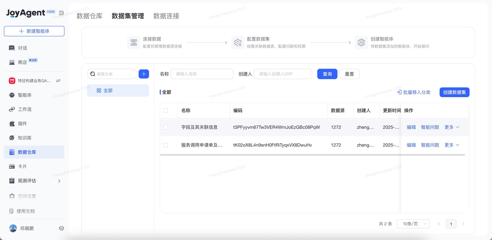

# AI认证申报-L2

## 一、 综述

**申报等级**：L2
**个人介绍：**

1. GPT诞生之初，就开始将AI工具应用在日常的学习与开发中，拥有三年的AI使用与探索经验。学生期间已使用免费开源的产品为主，包括：chatgpt、copilot、trae等。进入公司后使用公司提供的能力更强的模型，包括：claude 4-sonnet、joycode等。日常AI的使用场景有代码自动生成与补全、针对相应的方法设计测试用例以及编写UT、错误日志分析、文档辅助编写等。现能够熟练应用上述工具提升个人日常开发效率50%，提升日常测试效率80%。
2. 研究生期间主要研究方向为：多模态多标签学习、对比学习、小样本学习等，对强化学习、迁移学习有基础的了解，具备模型设计与微调、Prompt向量化、多模态特征特征提取、模型开发的经验。

## 二、 实战

### 1. AI 工具提效实战

- **应用场景**：bug修复与补充单测
- **工具组合**：joyCode + Claude 4 sonnet
- **问题背景**：最近系统出现一个bug，在UADS平台特征治理后，需要对存量无用特征进行清理，但是在清理过程中一个特征清理任务创建失败，导致所有的特征清理任务全部失败，我想出了改进的方案后，让AI帮助完成我完成代码开发。开发完成之后，我觉得这种异常case完全可以在UT中被发现，于是我让AI帮我针对修改后的代码，设计UT用例，并完成UT的开发，
- **Pompt分享：** https://joyspace.jd.com/pages/FSEgSojgZWwjhvv4o9ab
- **质量改进**：文档产出速度提升90%， UT覆盖率较以提升300%，UT编写效率提升300%。
- **成果：** AI生成的测试报告 https://joyspace.jd.com/file/O225YCMz3sTWIMF4DyLK
- **总结：** 对于上述的场景，我的工作就是通过写prompt，利用AI擅长的能力（编码、测试）将工作委派给AI来做，并利用自己的经验来check AI的工作，并给出自己的建议，让AI来优化工作方向。通过这种方式不仅可以提升工作效率，还可以利用AI远高于人类的能力来保障交付的质量。

### 2. joyFeature

- **应用场景**：利用Agent帮助研发人员解决日常零碎且冗余的客诉问题。
- **背景描述**：产品经常来找研发人员要求查看一些数据问题，这需要研发人员通过写sql的方式从数据库中查，查完之后导出excel，然后反馈给产品。
- **优化手段**：编写sql的方式恰恰是AI擅长的能力，于是在想是否能让AI知道我们的库表结构，针对于用户的问题，自主的去查询库中数据，并将查询结果反馈给用户。

- **最终效果**：通过在JoyAgent平台上配置数据源，在数据源中配置库表结构，对于表、字段、连接关系，进行准确的描述。目前，提问方式需要基于prompt模板进行提问，需要给出关键信息。若非如此，Agent不知道去查这个数据源，也就得不到期望的结果。
- **成果：**
  

### 3. 模型开发与训练

- **背景描述：** 研究生期间专注于多模态多标签分类研究，在毕业论文中提出了一种基于多尺度融合的多标签分类方法，并将图卷积网络（GCN）应用在多尺度特征提取中，在dualCoop模型上进行二次开发，最终将dualCoop模型的分类能力提升了1%。
- **能力提升：** 独立完成模型的开发、结果评测、调优等工作。
- **成果：** [代码仓库](https://gitee.com/dpbirder/MyModel)
