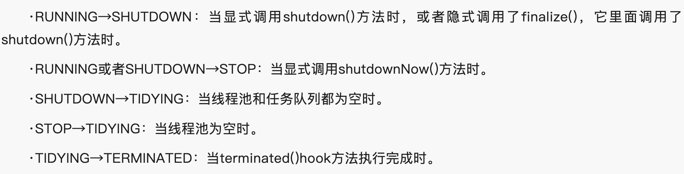
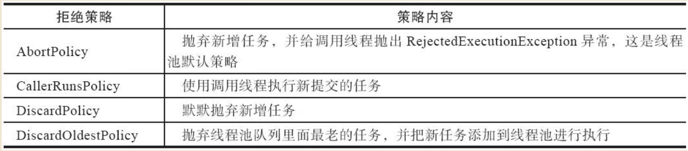
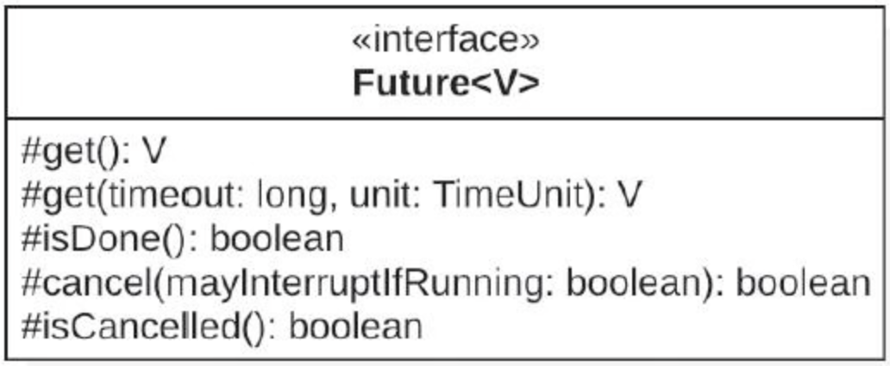
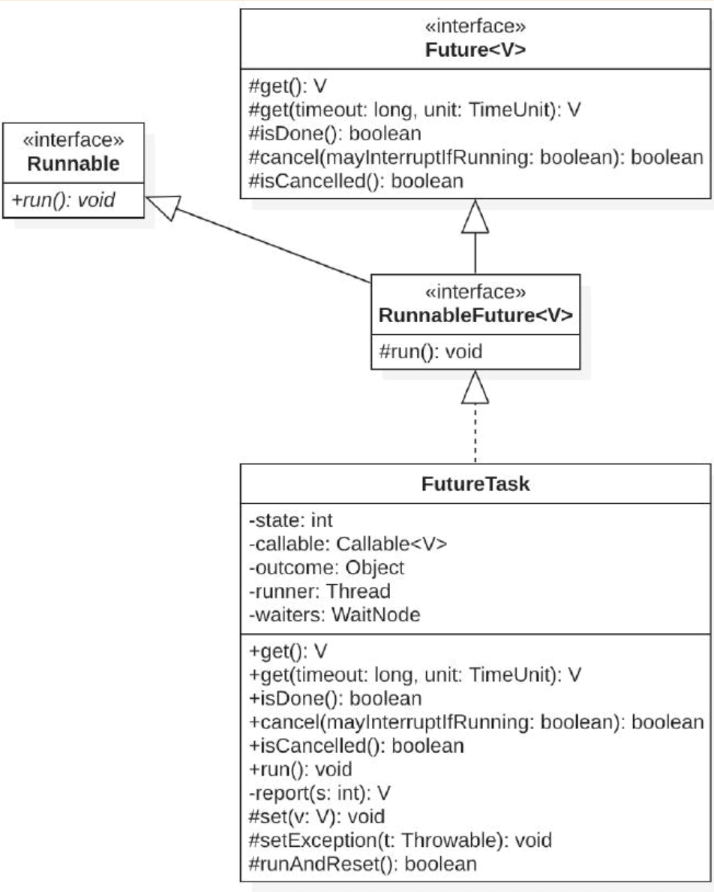

# 并发编程

## 什么是用户线程？什么是守护线程？

> JVM退出条件是进程中不包含任何的守护线程

## 线程

## 线程池

## 线程池的相关参数

## 线程池的几种状态



## 关闭线程的两种方式

```java
public List<Runnable> shutdownNow() {
    List<Runnable> tasks;
    final ReentrantLock mainLock = this.mainLock;
    mainLock.lock();
    try {
        checkShutdownAccess();
        advanceRunState(STOP);
        interruptWorkers();
        tasks = drainQueue();
    } finally {
        mainLock.unlock();
    }    tryTerminate();
    return tasks;
}

```

```java
public void shutdown() {
    final ReentrantLock mainLock = this.mainLock;
    mainLock.lock();
    try {
        checkShutdownAccess();
        advanceRunState(SHUTDOWN);
        interruptIdleWorkers();
        onShutdown(); // hook for ScheduledThreadPoolExecutor
    } finally {
        mainLock.unlock();
    }    tryTerminate();
}
```

## 线程池的拒绝策略



## Future

JUC包中代表异步任务执行结果的接口。


## FutureTask



##
