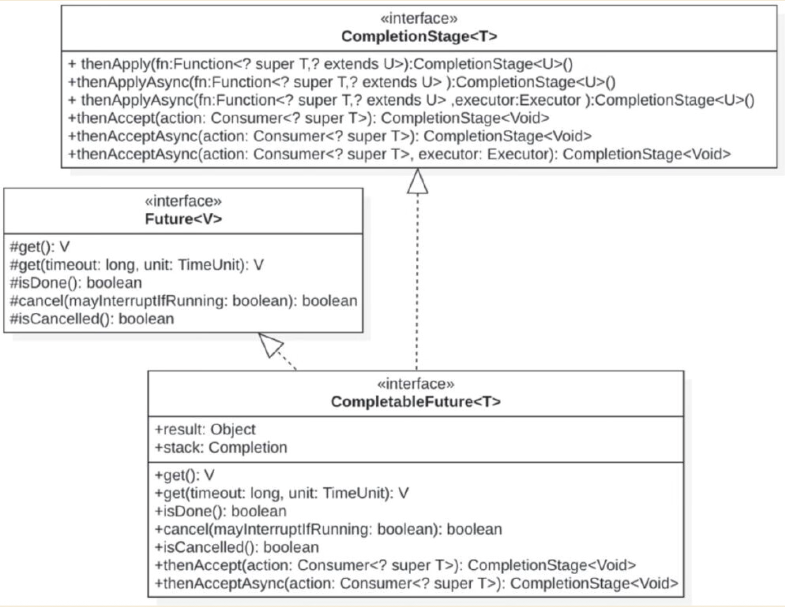
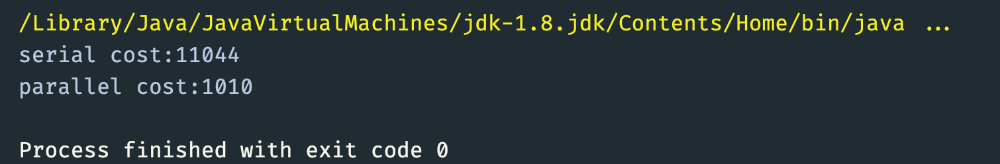
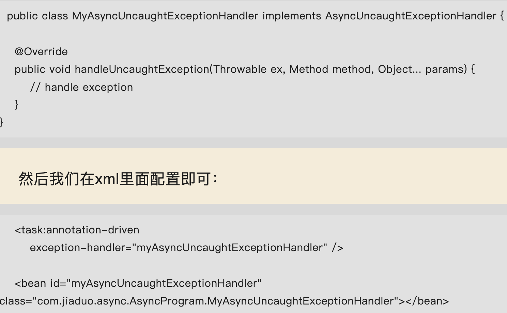
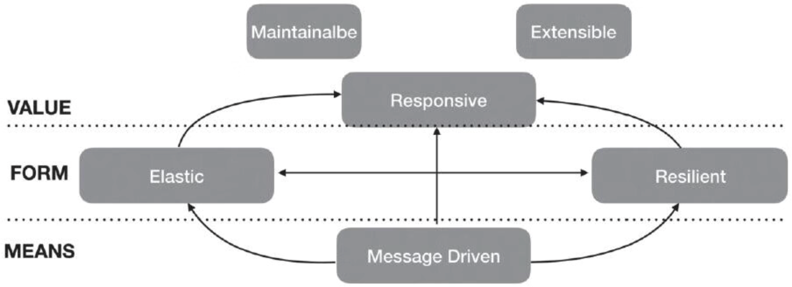

# 异步编程

ExecutorService实现类的一种，使用工作窃取算法来提高性能，专门用来执行分治任务的线程池。线程池内部每个工作线程够关联自己的内存队列，正常情况下每个线程会从自己的内存队列中获取任务来执行，让本身队列没有任务时，当前线程会去其他线程关联的队列中获取任务来执行。

`CommonPool`（公共ForkJoinPool）是JVM自动创建的一个默认`ForkJoinPool`实例。

## CompletableFuture

## 常用函数

- static complete() 显示设置异步计算结果
- static runAsync() 实现无返回值的异步计算
- static supplyAsync() 实现有返回值的异步计算
- thenRun() 实现执行任务A，执行完成后，激活任务B。这种激活方式任务B拿不到A的结果，且回调事件无返回值。
- thenAccept() 实现异步任务A，执行完成后，激活任务B。这种激活方式，任务B能够拿到任务A的执行结果。但该方法仍然没有返回值。
- thenApply() 实现异步任务A，执行完成后，激活任务B。这种激活方式，任务B能够拿到任务A的执行结果，并且可以获取到任务B的响应值。
- thenComplete() 设置回调函数，当异步任务执行完成后进行回调，不会阻塞调用线程（不需要显示的创建线程池并将任务提交到线程池中。

## 多个CompletableFuture组合运算

- 基于thenCompose实现两个CompletableFuture任务串行执行。
- 基于thenCombine事项两个并发任务执行结束后，使用二者的结果在作为参数实现一个异步任务。
- 基于allOf等待多个并发运行的CompletableFuture所有任务执行完毕。调用get方法获取result时，会阻塞调用线程。
- 基于anyOf等待多个并发运行的CompletableFuture中有一个任务执行完毕。调用get方法获取result时，会阻塞调用线程。

## 异步任务的异常处理

- 使用CompletableFuture.completeExceptionally 手动设置异步任务异常。
- 使用CompletableFuture.exceptionally(t -> "default").get() 当异步任务出现异常时，使用默认值处理。

## 实现



源码阅读：

```java
- runAsync(Runnable runnable)
- CompletableFuture<U> supplyAsync(Supplier<U> supplier)
- CompletableFuture<U> supplyAsync(Supplier<U> supplier, Executor executor)
```

## java Stream 与CompletableFuture结合案例

串行rpc调用

```java
/**
 * @author zhengzhanpeng.1029
 * @date 2025/10/28 00:34
 */
 public class MyExecutorPool {
    public static String rpcCall(String ip, String param ) {
        // System.out.println(ip + "rpcCall:" + param);

        try {
            Thread.sleep(1000);
        } catch (InterruptedException e) {
            e.printStackTrace();
        }        return param;
    }

    private static void serial(List<String> ipList) {
        // 2. 发起广播调用
        long start = System.currentTimeMillis();
        ArrayList<String> result = new ArrayList<>();
        for (String ip : ipList) {
            result.add(rpcCall(ip, ip));
        }        // 3. 输出
        // result.forEach(System.out::println);
        System.out.println("serial cost:" + (System.currentTimeMillis() - start));
    }

    private static void parallel(List<String> ipList) {
        long start = System.currentTimeMillis();
        List<CompletableFuture<String>> futures = ipList.stream()
                .map(ip -> CompletableFuture.supplyAsync(() -> rpcCall(ip, ip))).collect(Collectors.toList());

        List<String> results = futures.stream().map(CompletableFuture::join).collect(Collectors.toList());
        // 3. 输出结果
        // results.forEach(System.out::println);
        System.out.println("parallel cost:" + (System.currentTimeMillis() - start));

    }
    public static void main(String[] args) {
        // 1. 生成ip列表
        ArrayList<String> ipList = new ArrayList<>();
        for (int i = 0; i <= 10; i++) {
            ipList.add("192.168.0." + i);
        }
        serial(ipList);
        parallel(ipList);
}
```



## Spring中的异步编程

spring中分别使用TaskExecutor和TaskSchedule实现异步执行和任务调度的抽象。

## spring中常见的Executor

- SimplyAsycTaskExecutor
- SyncTaskExecutor
- ConcurrentTaskExecutor
- SimplyThreadPoolTaskExecutor
- ⭐️ThreadPoolTaskExecutor
- TimerTaskExecutor

## Spring中执行异步任务的两种方式

### 1、使用XML方式执行

第一步：注入一个`ThreadPoolTaskExecutor`处理器

```xml
<bean id="taskExecutor" class="org.springframework.scheduling.concurrent.ThreadPoolTaskExecutor">
        <property name="corePoolSize" value="5"/>
        <property name="maxPoolSize" value="10"/>
        <property name="keepAliveSeconds" value="60"/>
<!--        缓存队列大小-->
        <property name="queueCapacity" value="20"/>
        <property name="threadNamePrefix" value="taskExecutor-"/>
        <property name="rejectedExecutionHandler">
            <bean class="java.util.concurrent.ThreadPoolExecutor$CallerRunsPolicy"/>
        </property>
        <property name="waitForTasksToCompleteOnShutdown" value="true"/>
    </bean>
```

第二步：在spring bean中使用该执行器

```xml
<bean id="dynamicThreadPoolManager" class="com.jd.datacenter.console.service.config.DynamicThreadPoolManager">
    <property name="taskExecutor" ref="taskExecutor"/>
</bean>
```

第三步：定义spring bean并通过setter注入执行器属性

```java
public class DynamicThreadPoolManager {

    private TaskExecutor taskExecutor;

    /**
     * 构造函数.
     */
     public DynamicThreadPoolManager() {
        executor = new ThreadPoolTaskExecutor();
        initExecutor(defaultConfig());
    }

    public void setTaskExecutor(ThreadPoolTaskExecutor taskExecutor) {
        this.taskExecutor = taskExecutor;
    }

    public void shutdown() {
	    if(taskExecutor isinstanceof ThreadPoolTaskExecutor) {
		    ((ThreadPoolTaskExecutor) taskExecutor).shutdown();
	    }
    }
}
```

第四步：使用

!!! tip
1、ThreadPoolTaskExecutor中的线程都是用户线程非Deamon线程，而JVM退出条件是进程中不包含任意的用户线程。因此若要JVM退出，需要显示关闭线程池。
2、默认情况下ThreadPoolTaskExecutor中的变量waitForTasksToCompleteOnShutdown为false，需显示设置为true

### 2、使用注解方式执行 @Async

第一步：开启异步处理

- 基于bean配置
- 在启动类上使用注解`@EnableAsync`

```xml
<!--    1、开启Async注解解析-->
    <task:annotation-driven />

<!--    2、注入业务Bean-->
<bean id="dynamicThreadPoolManager" class="com.jd.datacenter.console.service.config.DynamicThreadPoolManager"/>
```

未指定异步任务执行线程时，默认使用`SimpleAsyncTaskExecutor`

第二步：指定执行任务的线程 `@Async("myExecutor")`

第三步：获取异步任务的结果
可以使用`CompletableFuture<?>`获取异步任务的结果。

第四步：处理异步任务异常
使用`AsyncUncaughtExceptionHandler#handleUncaughtException`处理异常，并在xml中配置。


## 反应式编程

状态会随着中间过程的变化而变化。

- 即时响应性
- 回弹性（类似于熔断）
- 弹性（类似于动态线程池）
- 消息驱动（类似于消息队列）



反应式编程旨在解决JVM上“经典”异步编程的缺点，同时关注一些其他方面：

- 代码的可组合性和可读性
- 数据作为一个用丰富的运算符词汇表操作的流程
- 在订阅之前没有发生任何事情
- 回压或消费者向生产者发出信号表明发射元素过快的能力
- 高级但高价的抽象，与并发无关

!!! info "CallBack Hell"
对于负责的异步任务处理，需要回调执行回调，形成多层嵌套，使代码很难回归，并推理业务逻辑。

## Reactive Streams 规范

!!! info "背压"
依据消费者的消费能力，来控制生产者生产消息的速率。

| 接口              | 作用                           | 类比           |
| ----------------- | ------------------------------ | -------------- |
| `Publisher<T>`    | 发布者：生产数据               | 水龙头         |
| `Subscriber<T>`   | 订阅者：消费数据               | 水桶           |
| `Subscription`    | 订阅关系：控制流量（背压）     | 水管阀门       |
| `Processor<T, R>` | 处理器：即时发布者，也是订阅者 | 过滤器、增压泵 |
