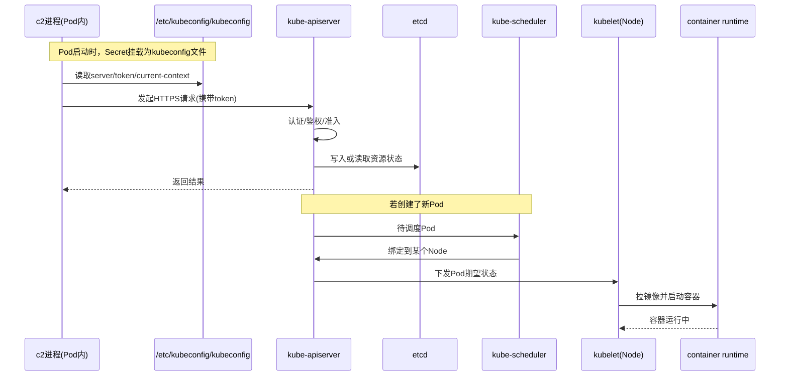

# Kubernetes 学习

## kubeconfig 介绍

`kubeconfig` 是 Kubernetes 客户端配置文件，用来告诉 `kubectl` 或程序：

1. 连接哪个集群（API Server 地址）。
2. 用什么身份认证（token/证书）。
3. 默认使用哪个上下文（cluster + user + namespace 组合）。

加载方式：

1. 显式参数 `--kubeconfig <path>`。
2. 环境变量 `KUBECONFIG`。
3. 默认路径 `~/.kube/config`。

### 示例

```yaml
apiVersion: v1 # kubeconfig 文件版本，当前通用为 v1
clusters: # 可连接的集群列表
  - cluster:
      insecure-skip-tls-verify: true # 是否跳过服务端 TLS 证书校验；true 方便但有安全风险
      server: https://api.lfbox02.jdos.jd.local:6443 # Kubernetes API Server 地址
    name: cluster-auth # 该集群条目的逻辑名称（供 context 引用）

contexts: # 上下文列表：把 cluster + user (+ namespace) 绑定在一起
  - context:
      cluster: cluster-auth # 引用上面 clusters.name=cluster-auth
      namespace: feature-master # 默认命名空间；不加 -n 时默认落在这里
      user: kubecfg # 引用 users.name=kubecfg
    name: cluster-auth # context 的名称

current-context: cluster-auth # 当前默认使用的 context
kind: Config # 对象类型，固定为 Config

users: # 用户认证信息列表
  - name: kubecfg # 用户条目的逻辑名称（供 context 引用）
    user:
      token: <redacted> # Bearer Token，用于向 API Server 认证
```

### 使用

1. 客户端（kubectl 或程序）读取 kubeconfig。
2. 用其中的 server + token/证书 请求 API Server。
3. API Server先做认证（你是谁）。
4. 再做 RBAC 鉴权（你能对哪个 namespace 的哪些资源做什么动作）。
5. 通过才允许操作资源，调用Kubernetes API

### kubectl查找过程

1. `current-context` 表示当前默认使用哪个 `context`。
2. `context.cluster` 的值会按名称去匹配 `clusters[].name`，从而找到实际要连接的 `server`。
3. `context.user` 的值会按名称去匹配 `users[].name`，从而找到实际要使用的 `token` 或证书。
4. `context.namespace` 表示默认命名空间。
5. 所以 `kubectl` 或程序的查找过程就是：先读 `current-context`，再找到对应的 `context`，最后根据其中的 `cluster` 和 `user` 名称，定位到真正的 `server`、认证信息和默认 `namespace`。

### 与物理机房的关系

1. `server` 指向哪个 API Server，就连接到哪个 Kubernetes 集群入口。
2. 是否落到某个机房/节点，不由 kubeconfig 直接决定，而由调度策略（如 `nodeSelector/affinity`）和集群拓扑决定。

### 安全建议

1. `token` 属于高敏感凭证，建议不要明文入库。
2. 建议改用密文管理（Secret 管理系统、CI 注入）并定期轮转。
3. 生产环境尽量不要长期使用 `insecure-skip-tls-verify: true`。

### kubeconfig 在 c2 场景下的时序图



## 常用命令

### 1. 查看命名空间下的 Pods（含 `-o wide`）

命令：
`kubectl get pods -n <namespace>`

扩展命令（查看更多排查信息）：
`kubectl get pods -n <namespace> -o wide`

参数说明：

- `get`：查询资源列表。
- `pods`：资源类型，表示 Pod。
- `-n`：`--namespace` 的简写，指定命名空间。
- `<namespace>`：命名空间名称，例如 `default`、`kube-system`。
- `-o wide`：在默认输出基础上，增加排查常用字段（如 `NODE`、`IP` 等）。

什么时候用 `-o wide`：

1. 怀疑是节点维度问题（某台机器异常）时。
2. 要核对 Pod IP、跨节点分布、网络连通性时。
3. 要快速对比正常 Pod 与异常 Pod 是否落在同一节点时。

示例：
`kubectl get pods -n default`
`kubectl get pods -n feature-worker -o wide`

### 2. 查看 Pod 详细信息

命令：
`kubectl describe pod <pod-name> -n <namespace>`

参数说明：

- `describe`：查看资源的详细描述（事件、状态、容器信息等）。
- `pod`：资源类型，表示单个 Pod。
- `<pod-name>`：Pod 名称。
- `-n`：`--namespace` 的简写，指定命名空间。
- `<namespace>`：命名空间名称。

示例：
`kubectl describe pod nginx-6f7d7cbdc8-abcde -n default`

### 3. 删除 Pod

命令：
`kubectl delete pod <pod-name> -n <namespace>`

参数说明：

- `delete`：删除指定资源。
- `pod`：资源类型，表示单个 Pod。
- `<pod-name>`：要删除的 Pod 名称。
- `-n`：`--namespace` 的简写，指定命名空间。
- `<namespace>`：命名空间名称。

示例：
`kubectl delete pod nginx-6f7d7cbdc8-abcde -n default`

### 4. 实时查看 Pod 日志

命令：
`kubectl logs -f <pod-name> -n <namespace>`

参数说明：

- `logs`：查看 Pod 日志。
- `-f`：`--follow` 的简写，持续输出日志（类似 `tail -f`）。
- `<pod-name>`：Pod 名称。
- `-n`：`--namespace` 的简写，指定命名空间。
- `<namespace>`：命名空间名称。

示例：
`kubectl logs -f nginx-6f7d7cbdc8-abcde -n default`

## 资源作用域说明

在 Kubernetes 中，资源按照作用域可分为命名空间级资源与集群级资源。该分类直接决定了资源的寻址方式、权限边界与运维操作路径。

命名空间级资源是指资源实例隶属于某一具体命名空间，其名称仅在所在命名空间内需要保持唯一。对该类资源执行查询、变更与删除操作时，应显式指定命名空间。典型示例包括 Pod、Deployment、Service、ConfigMap、Secret 等；在本项目中，ShardGroup、CarbonJob、WorkerNode 亦按命名空间级资源处理。

集群级资源是指资源实例不隶属于任何命名空间，其生命周期与可见范围覆盖整个集群。对该类资源进行操作时通常不携带命名空间参数。典型示例包括 Namespace、Node、CustomResourceDefinition（CRD）等。

在工程实践中，建议先明确目标资源的作用域，再编写或调用客户端逻辑，以避免因作用域判断错误导致的资源未命中、权限异常或误操作。

## 问题排查记录

### 场景

`feature-master` 命名空间中 `ops-swift` Pod 持续 `CrashLoopBackOff`，容器退出码 `255`，无法就绪。

### 排查思路

1. 先排除基础问题：调度、镜像拉取、资源不足（OOM）。
2. 再定位应用级失败：优先看 `describe` 的 `Last State` 与 `Events`，再看 `logs --previous`。
3. 由于标准输出信息过少，进入同镜像调试环境读取落盘日志（`logs/swift/swift.log`）。
4. 最后回溯到配置生成链路，确认模板变量来源与最终渲染结果。

### 关键指令

1. 查看 Pod 状态
   `kubectl get po -n feature-master`

2. 查看 Pod 详情（重启原因、事件）
   `kubectl describe pod <pod-name> -n feature-master`

3. 查看当前与上次崩溃日志
   `kubectl logs <pod-name> -n feature-master`
   `kubectl logs <pod-name> -n feature-master --previous`

4. 查看 Deployment 启动参数与环境变量
   `kubectl get deploy ops-swift -n feature-master -o yaml`

5. 在调试 Pod 中复现启动并读取落盘日志
   `swift_admin -l /ha3_install/usr/local/etc/swift/swift_alog.conf -w . -c zfs://.../config/<version>`
   `sed -n '1,200p' logs/swift/swift.log`

6. 直接读取线上生效配置
   `/ha3_install/usr/local/bin/fs_util cat zfs://.../ops-swift/appmaster/config/<version>/swift.conf`

### 结果分析

1. 调度、拉镜像、资源均正常，问题不在基础设施层。
2. `swift.log` 明确报错：`UserName can't be empty.`，导致 `swift_admin` 初始化失败并退出。
3. 线上配置文件 `swift.conf` 实际内容为 `user_name=`（空值），与报错一致。
4. 根因是模板变量 `default_variables.user` 未被正确填充，最终通过在 Java 侧补齐初始化兜底解决。

### 经验总结

1. `CrashLoopBackOff` 首先看 `--previous`，能最快拿到上一次退出前的关键信息。
2. 标准输出不足时，要看容器内业务日志文件，而不只看 `kubectl logs`。
3. 配置类问题必须“看最终生效配置”，不要只看代码或模板。
4. 修复后应验证三件事：新配置版本是否下发、配置值是否正确、Pod 是否稳定 `1/1`。

## Swift Broker CrashLoop 排查命令（学习版）

### 1. 排查目标与方法

目标：`5 分钟内定位是“集群层问题”还是“应用配置问题”`。

方法：按固定顺序执行，避免来回跳。

1. `看状态`：先确认哪些 Pod 异常。
2. `看原因`：用 `describe` 找退出原因和事件。
3. `看日志`：优先看 `--previous` 拿到上一次崩溃信息。
4. `看配置`：去线上生效配置里核对关键字段。
5. `做修复`：清理冲突实例或修正配置后再观察。

### 2. 一组最小可复用命令

```shell
# 1) 全局看状态（master + worker）
kubectl get pods -n feature-master
kubectl get pods -n feature-worker
kubectl get pods -n feature-worker -o wide

# 2) 精准定位异常 broker
kubectl get pods -n feature-worker | grep zhengzhanpeng.1029-ops-swift.default--broker

# 3) 看退出原因（Events / Last State）
kubectl describe pod -n feature-worker zhengzhanpeng.1029-ops-swift.default--broker-0-0-a-353a

# 4) 看上一次崩溃日志（CrashLoopBackOff 必查）
kubectl logs -n feature-worker zhengzhanpeng.1029-ops-swift.default--broker-0-0-a-353a --previous

# 5) 看编排对象（确认参数是怎么下发的）
kubectl get workernode -n feature-worker | grep zhengzhanpeng.1029-ops-swift.default--broker
kubectl get workernode -n feature-worker zhengzhanpeng.1029-ops-swift.default--broker-0-0-a -o yaml
kubectl get carbonjob -n feature-worker | grep zhengzhanpeng.1029-ops-swift
kubectl get carbonjob -n feature-worker zhengzhanpeng.1029-ops-swift -o yaml

# 6) 对比正常实例与异常实例的启动参数
kubectl get workernode -n feature-worker john-ops-swift.default--broker-2-0-a -o jsonpath="{.spec.template.spec.containers[0].args}"
kubectl get workernode -n feature-worker zhengzhanpeng.1029-ops-swift.default--broker-2-0-a -o jsonpath="{.spec.template.spec.containers[0].args}"

# 7) 在 admin pod 内读取线上生效配置（关键）
kubectl exec -n feature-master ops-swift-845cbf66b4-d8t2j -- sh -lc "export PATH=/ha3_install/usr/local/bin:$PATH; fs_util cat zfs://ha31.zk.jd.local:3990/cluster-ops/ops-swift/appmaster/config/1772532537/swift.conf"
kubectl exec -n feature-master ops-swift-845cbf66b4-d8t2j -- sh -lc "export PATH=/ha3_install/usr/local/bin:$PATH; fs_util cat zfs://ha31.zk.jd.local:3990/cluster-ops/ops-swift/appmaster/config/version"

# 8) 看 admin 侧业务日志
kubectl exec -n feature-master ops-swift-845cbf66b4-d8t2j -- sh -lc "tail -n 260 ./logs/swift/swift.log"
kubectl exec -n feature-master ops-swift-845cbf66b4-d8t2j -- sh -lc "grep -nE \"ERROR|FATAL|fail|Failed\" ./logs/swift/swift.log | tail -n 200"

# 9) 修复动作：删除冲突集群
kubectl get carbonjob -n feature-worker | grep john-ops-swift
kubectl delete carbonjob -n feature-worker john-ops-swift --wait=false
kubectl get pods -n feature-worker | grep john-ops-swift.default--broker
```

### 3. 这组命令各自解决什么问题

- `kubectl get pods`：判断是否是“普遍故障”还是“单应用故障”。
- `kubectl describe pod`：拿到退出码、探针失败、调度失败、镜像问题等结构化原因。
- `kubectl logs --previous`：CrashLoop 场景最关键，拿“上一轮崩溃前”日志。
- `kubectl get ... -o yaml/jsonpath`：看真实下发参数，不靠猜。
- `kubectl exec ... fs_util cat`：直接看线上生效配置，确认“代码/模板/下发”哪一层出错。

### 4. 常见坑

1. 只看 `kubectl logs` 不看 `--previous`，会漏掉真正的崩溃信息。
2. 只看代码模板，不看“线上生效配置”，容易误判。
3. 只盯 Pod，不看 `workernode/carbonjob`，会错过编排层参数问题。
4. 删除对象后不复查，无法确认修复是否生效。

### 5. 建议你记住的 3 个模板

```shell
# 模板 A：CrashLoop 三连
kubectl get pods -n <ns>
kubectl describe pod -n <ns> <pod>
kubectl logs -n <ns> <pod> --previous

# 模板 B：参数对比
kubectl get <obj> -n <ns> <name-good> -o jsonpath="{...}"
kubectl get <obj> -n <ns> <name-bad>  -o jsonpath="{...}"

# 模板 C：线上配置核对
kubectl exec -n <ns> <admin-pod> -- sh -lc "fs_util cat <config-path>"
```

## Swift Broker CrashLoop 实战过程（时间线）

### 场景

- 现象：`feature-worker` 下 `zhengzhanpeng.1029-ops-swift.default--broker-*` 持续 `CrashLoopBackOff/Error`。
- 同时观察到：`john-ops-swift.default--broker-*` 也在运行，存在资源/配置冲突风险。

### 排查步骤

1. 先看状态范围。
   - 执行：`kubectl get pods -n feature-master`、`kubectl get pods -n feature-worker`。
   - 结论：异常集中在你这套 broker，非全局故障。

2. 看异常 Pod 的退出信息。
   - 执行：`kubectl describe pod ...`、`kubectl logs ... --previous`。
   - 结论：容器重复拉起失败，属于应用启动阶段失败。

3. 看编排层对象和参数。
   - 执行：`kubectl get workernode ... -o yaml`、`kubectl get carbonjob ... -o yaml`。
   - 结论：需要对比正常实例与异常实例参数差异。

4. 进入 admin pod 读线上生效配置。
   - 执行：`kubectl exec ... fs_util cat zfs://.../swift.conf`。
   - 结论：定位到关键配置值异常（例如历史排查里出现过 `user_name=` 为空）。

5. 查看 admin 侧业务日志确认根因。
   - 执行：`kubectl exec ... tail/grep ./logs/swift/swift.log`。
   - 结论：日志与配置问题一致，确认并非 Kubernetes 调度层问题。

6. 做修复并复查。
   - 执行：删除冲突 `carbonjob`（如 `john-ops-swift`），再看 pod 状态。
   - 结论：冲突实例清理后，重新观察 broker 拉起结果。

### 这次实战得到的固定流程

1. `get` 定位范围。
2. `describe + logs --previous` 锁定失败点。
3. `workernode/carbonjob` 看参数来源。
4. `exec + fs_util cat` 看最终配置。
5. 修复后必须回到 `get pods` 做闭环验证。
