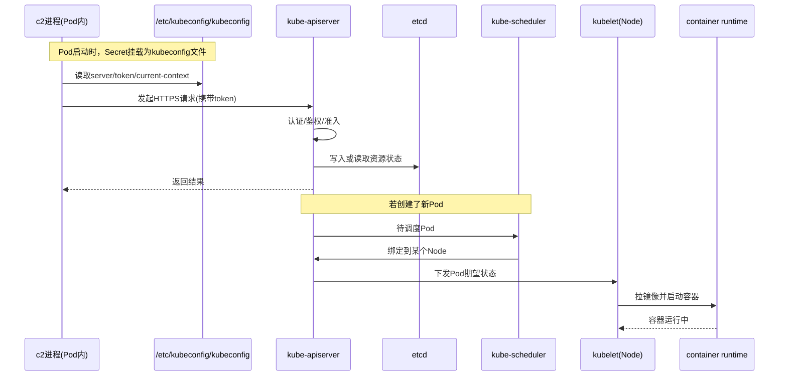

# kubeconfig

## kubeconfig 介绍

`kubeconfig` 是 Kubernetes 客户端配置文件，用来告诉 `kubectl` 或程序：

1. 连接哪个集群（API Server 地址）。
2. 用什么身份认证（token/证书）。
3. 默认使用哪个上下文（cluster + user + namespace 组合）。

加载方式：

1. 显式参数 `--kubeconfig <path>`。
2. 环境变量 `KUBECONFIG`。
3. 默认路径 `~/.kube/config`。

### 示例

```yaml
apiVersion: v1 # kubeconfig 文件版本，当前通用为 v1
clusters: # 可连接的集群列表
  - cluster:
      insecure-skip-tls-verify: true # 是否跳过服务端 TLS 证书校验；true 方便但有安全风险
      server: https://api.lfbox02.jdos.jd.local:6443 # Kubernetes API Server 地址
    name: cluster-auth # 该集群条目的逻辑名称（供 context 引用）

contexts: # 上下文列表：把 cluster + user (+ namespace) 绑定在一起
  - context:
      cluster: cluster-auth # 引用上面 clusters.name=cluster-auth
      namespace: feature-master # 默认命名空间；不加 -n 时默认落在这里
      user: kubecfg # 引用 users.name=kubecfg
    name: cluster-auth # context 的名称

current-context: cluster-auth # 当前默认使用的 context
kind: Config # 对象类型，固定为 Config

users: # 用户认证信息列表
  - name: kubecfg # 用户条目的逻辑名称（供 context 引用）
    user:
      token: <redacted> # Bearer Token，用于向 API Server 认证
```

### 使用

1. 客户端（kubectl 或程序）读取 kubeconfig。
2. 用其中的 server + token/证书 请求 API Server。
3. API Server先做认证（你是谁）。
4. 再做 RBAC 鉴权（你能对哪个 namespace 的哪些资源做什么动作）。
5. 通过才允许操作资源，调用Kubernetes API

### kubectl查找过程

1. `current-context` 表示当前默认使用哪个 `context`。
2. `context.cluster` 的值会按名称去匹配 `clusters[].name`，从而找到实际要连接的 `server`。
3. `context.user` 的值会按名称去匹配 `users[].name`，从而找到实际要使用的 `token` 或证书。
4. `context.namespace` 表示默认命名空间。
5. 所以 `kubectl` 或程序的查找过程就是：先读 `current-context`，再找到对应的 `context`，最后根据其中的 `cluster` 和 `user` 名称，定位到真正的 `server`、认证信息和默认 `namespace`。

### 与物理机房的关系

1. `server` 指向哪个 API Server，就连接到哪个 Kubernetes 集群入口。
2. 是否落到某个机房/节点，不由 kubeconfig 直接决定，而由调度策略（如 `nodeSelector/affinity`）和集群拓扑决定。

### 安全建议

1. `token` 属于高敏感凭证，建议不要明文入库。
2. 建议改用密文管理（Secret 管理系统、CI 注入）并定期轮转。
3. 生产环境尽量不要长期使用 `insecure-skip-tls-verify: true`。

### kubeconfig 在 c2 场景下的时序图


