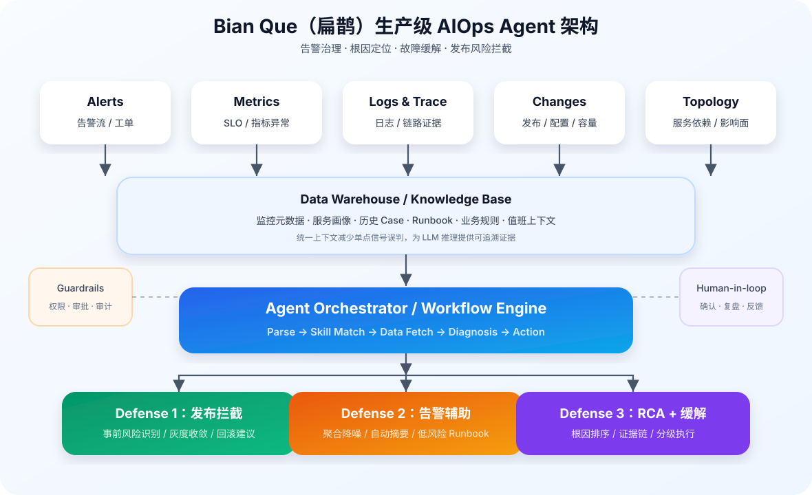
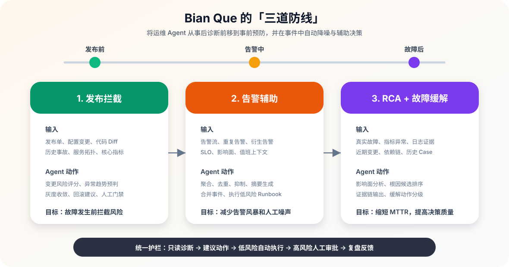
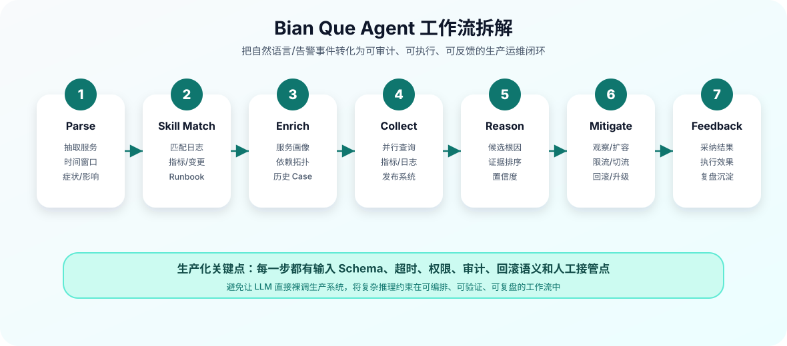

# 运维 Agent 系统深度研究与落地分享

> 调研日期：2026-06-16
> 重点领域：运维/SRE/DevOps 智能体系统

## 分享导读

这篇文章面向一次「运维 Agent」技术分享，目标不是泛泛介绍大模型 Agent，而是回答三个更落地的问题：

1. **运维 Agent 到底解决什么问题？** 重点是告警风暴、故障定位慢、Runbook 执行依赖人工、历史经验难复用。
2. **生产级运维 Agent 应该怎么设计？** 不能只做 Chatbot，而要围绕观测数据、工具调用、工作流编排、安全护栏和反馈闭环构建系统。
3. **从哪里开始落地最稳？** 建议从只读诊断和告警降噪开始，再逐步扩展到低风险自动处置，最后进入自愈闭环。

**一句话结论**：运维 Agent 的关键不是「让大模型直接接管生产」，而是把大模型放进可观测、可审计、可回滚的运维工作流里，让它先成为可靠的一线辅助，再逐步承担自动化处置能力。

**建议分享结构**： 

| 模块 | 建议时长 | 讲什么 | 听众收获 |
| ---- | -------- | ------ | -------- |
| 1. 背景与问题 | 5 分钟 | 为什么传统 AIOps/告警平台还不够 | 建立痛点共识 |
| 2. Agent 基础 | 8 分钟 | Workflow vs Agent、工具、记忆、RAG | 理解技术底座 |
| 3. 运维架构案例 | 20 分钟 | AIOpsLab、RCAgent、Bian Que、DeepFlow 等 | 看清主流设计模式 |
| 4. 生产落地方案 | 15 分钟 | 闭环架构、自愈、护栏、人机协同 | 知道怎么做、先做什么 |
| 5. 总结与讨论 | 5 分钟 | 最佳实践、风险和开放问题 | 形成行动清单 |

**阅读方式**：如果时间有限，优先阅读第三章的 Bian Que、DeepFlow、架构模式总结，以及第六章的落地挑战与最佳实践。

## 一、核心架构模式

### 1.1 Agent 系统的基本组成

根据 Lilian Weng（OpenAI 研究员）的经典框架，LLM 驱动的自主 Agent 系统由三大核心组件构成：

```
┌─────────────────────────────────────────────┐
│              LLM (大脑/控制器)                │
├─────────────┬──────────────┬────────────────┤
│   规划       │    记忆       │   工具使用      │
│  Planning   │   Memory     │   Tool Use     │
├─────────────┼──────────────┼────────────────┤
│ • CoT推理    │ • 短期记忆    │ • API调用      │
│ • 任务分解   │  (上下文窗口) │ • 代码执行      │
│ • 反思/修正  │ • 长期记忆    │ • 搜索检索      │
│ • ReAct     │  (向量存储)   │ • 外部系统交互   │
└─────────────┴──────────────┴────────────────┘
```

### 1.2 主要架构模式对比

| 模式                 | 核心思路                        | 适用场景            | 运维应用           |
| -------------------- | ------------------------------- | ------------------- | ------------------ |
| **ReAct**            | Thought→Action→Observation 循环 | 需要推理+执行的任务 | 故障诊断、日志分析 |
| **Plan-and-Execute** | 先制定完整计划再逐步执行        | 复杂多步骤任务      | 变更执行、容量规划 |
| **Reflexion**        | 执行后反思错误并迭代改进        | 需要试错学习的场景  | 性能调优、配置优化 |
| **多智能体协作**     | 多个专职Agent协同工作           | 大规模复杂系统      | 全链路故障管理     |

### 1.3 Workflow vs Agent（Anthropic 关键区分）

> 来源: [Anthropic Building Effective Agents](https://www.anthropic.com/research/building-effective-agents)
> Anthropic 与数十个团队合作后的核心发现：最成功的实现并没有使用复杂框架或专业库。

**基础构建块 — 增强型 LLM**：
每个 Agentic 系统的起点是增强了检索、工具和记忆的 LLM，通过 MCP 提供标准化集成。

**Workflow vs Agent**：

- **Workflow**: LLM 通过**预定义代码路径**编排，确定性流程
- **Agent**: LLM **动态指导自身过程**和工具使用，自主决策

**五种 Workflow 模式**：

```
1. Prompt Chaining (提示链)
   任务 → 步骤A → [验证门] → 步骤B → 结果
   适用: 可清晰分解为固定子任务的场景

2. Routing (路由)
   输入 → 分类 → 专用处理通道 (简单→Haiku / 复杂→Sonnet)
   适用: 不同类型的输入需要不同处理策略

3. Parallelization (并行)
   • Sectioning: 独立子任务并行执行
   • Voting: 同任务多次执行取多样性输出
   适用: 子任务间无依赖或需多视角验证

4. Orchestrator-Workers (编排-工人)
   编排 LLM → 动态分解任务 → 分派给 Worker LLM → 合成结果
   适用: 子任务不确定、需要根据输入动态决定 (如多文件代码修改)

5. Evaluator-Optimizer (评估-优化循环)
   生成 LLM ↔ 评估 LLM (循环直到满意)
   适用: 可通过反馈明确改进的场景 (如翻译迭代)
```

**Agent 的适用条件**：

- 开放式问题，步骤不可预测
- 无法硬编码固定路径
- 模型的决策能力值得信赖

**Agent 实现的三个核心原则**：

1. **简单性** — 复杂度仅在可证明改善结果时才添加
2. **透明性** — 明确展示规划步骤
3. **工具设计** — 花在工具优化上的时间应该超过总体 Prompt

**工具设计最佳实践 (ACI — Agent-Computer Interface)**：

- 给模型足够 Token 去「思考」，避免自我困住
- 格式贴近模型在互联网上见过的自然文本
- 避免格式开销（精确行计数、字符串转义）
- 应用 Poka-yoke 原则 — 让参数更难被误用
- Anthropic 在 SWE-bench Agent 中「花在优化工具上的时间超过了优化整体 Prompt」
- 示例：将相对路径切换为绝对路径消除了一整类错误

### 1.4 多智能体架构

LangGraph 定义的三种模式：

1. **Multi-Agent Collaboration** — 共享草稿板，Agent 间平等协作
2. **Agent Supervisor** — 监督者路由任务到独立 Agent
3. **Hierarchical Agent Teams** — 层级结构，子 Agent 本身是完整的 Agent 图

多智能体相比单 Agent 的三大优势：

- 工具/职责分组提高成功率（聚焦比全能更可靠）
- 独立 Prompt 优化效果更好
- 各 Agent 可独立评估和改进

---

## 二、运维 Agent 关键技术组件

### 2.1 工具调用（Tool Use）

运维 Agent 的核心能力依赖工具集设计：

```
运维 Agent 工具分类:
├── 观测工具: 日志查询、指标查看、链路追踪、拓扑查询
├── 诊断工具: 根因定位、异常检测、关联分析
├── 执行工具: 重启服务、扩缩容、配置变更、流量调度
├── 知识工具: 文档检索、历史案例、运维知识库
└── 通信工具: 通知告警、协作沟通、工单管理
```

**MCP（Model Context Protocol）**：

- Anthropic 推出的开源标准，连接 AI 与外部系统
- 客户端-服务器架构（Host/Client/Server）
- 基于 JSON-RPC 2.0
- 定义三种服务端原语：**Tools**（可执行函数）、**Resources**（数据源）、**Prompts**（模板）
- 已被 Claude、ChatGPT、VS Code、Cursor 等支持
- 对运维 Agent 意义：提供**标准化工具集成方式**

### 2.2 记忆管理（Memory）

```
┌─────────────────────────────────────┐
│           Agent 记忆体系             │
├─────────────────┬───────────────────┤
│    短期记忆      │     长期记忆       │
│ (上下文窗口)     │ (外部存储)         │
├─────────────────┼───────────────────┤
│ • 当前对话历史   │ • 向量数据库       │
│ • 工作草稿板    │ • 知识图谱         │
│ • 中间推理结果   │ • 历史案例库       │
│               │ • 运维经验积累      │
└─────────────────┴───────────────────┘
```

**RCAgent 的创新方案 — OBSK（Observation Snapshot Key）**：

- 仅向控制器展示观测数据的头部摘要
- 完整数据存储在 KV Store 中通过 hash ID 引用
- 解决云环境下长日志/大表格/代码的上下文溢出问题

### 2.3 RAG 演进（检索增强生成）

```
朴素RAG → 高级RAG → 模块化RAG → Agentic RAG
  │         │         │           │
  │         │         │           └→ Agent自主决定何时检索、检索什么
  │         │         └→ 可互换模块：搜索/记忆/路由/预测/适配器
  │         └→ 预检索优化 + 后检索重排序
  └→ 简单的检索-阅读管道
```

对运维 Agent 的意义：Agentic RAG 允许 Agent 自主判断何时需要检索知识库（如历史故障案例），何时依赖自身参数化知识。

### 2.4 规划能力

- **CoT（思维链）**：逐步推理，将复杂故障分解为可管理的子问题
- **任务分解**：把「服务不可用」分解为「检查网络→检查进程→检查配置→检查依赖」
- **TSC（轨迹级自洽性）**：RCAgent 提出，在最终阶段采样多条轨迹取共识，根因预测 METEOR +16.49

---

## 三、Agent 自动化运维系统（深度解析）

> 本章基于用户参考的 14 个运维智能体系统，深入分析自动化运维 Agent 的架构设计。

分享时建议把这一章作为核心：不要逐个系统平铺直叙，而是围绕一条演进主线讲清楚：

```text
知识问答助手
  ↓
只读诊断 Agent
  ↓
多工具 RCA Agent
  ↓
告警治理 + Runbook 执行
  ↓
带护栏的生产自愈 Agent
```

这条路线也对应落地成熟度：先让 Agent「看懂问题」，再让它「查证据」，然后让它「给方案」，最后才让它「执行动作」。

### 3.1 运维智能体系统全景分类

根据参考文章中的 14 个系统，按功能定位和架构模式分类：

从分享角度，可以把这些系统分成五类：**平台型解决工程化问题，观测型解决数据底座问题，诊断型解决 RCA 问题，自治型解决闭环执行问题，辅助型解决知识入口问题**。真正落地时通常不是五选一，而是逐步组合。

```
┌─────────────────────────────────────────────────────────────────┐
│                    运维智能体系统分类全景                           │
├─────────────────────────────────────────────────────────────────┤
│                                                                 │
│  ┌─ 平台型（全生命周期）─────────────────────────────────────┐   │
│  │  • 微软 AIOpsLab: Agent 设计/开发/评估的整体框架            │   │
│  │  • Truefoundry: MLOps+LLMOps+InfraDevOps 一体化平台       │   │
│  │  • Gemini Cloud Assist: GCP 原生全生命周期助手             │   │
│  └───────────────────────────────────────────────────────────┘   │
│                                                                 │
│  ┌─ 观测型（全栈可观测性）───────────────────────────────────┐   │
│  │  • IBM Instana: Agentic AI 全栈观测                       │   │
│  │  • Davis AI (Dynatrace): 因果+预测+生成式 AI 三合一       │   │
│  │  • DeepFlow 智能体: 大模型驱动业务连续性保障               │   │
│  └───────────────────────────────────────────────────────────┘   │
│                                                                 │
│  ┌─ 诊断型（根因分析）───────────────────────────────────────┐   │
│  │  • RCAgent: LLM 自主智能体云平台根因分析                   │   │
│  │  • Microsoft Argos: LLM 构建可解释异常检测规则             │   │
│  └───────────────────────────────────────────────────────────┘   │
│                                                                 │
│  ┌─ 自治型（自主运维）───────────────────────────────────────┐   │
│  │  • STRATUS: 面向云平台的多智能体自主可靠性工程             │   │
│  │  • AWS DevOps Agent: 自主云运维                           │   │
│  │  • Bian Que: 生产级运维 Agent（告警-75%，MTTR÷2）         │   │
│  │  • OpenDerisk: AI 驱动工业级 SRE 框架                     │   │
│  └───────────────────────────────────────────────────────────┘   │
│                                                                 │
│  ┌─ 辅助型（知识问答）───────────────────────────────────────┐   │
│  │  • Ask Red Hat: 技术问答和故障排除指导                     │   │
│  └───────────────────────────────────────────────────────────┘   │
│                                                                 │
└─────────────────────────────────────────────────────────────────┘
```

### 3.2 关键系统架构深度解析

#### 3.2.1 微软 AIOpsLab — Agent 开发评估框架

> 论文: "AIOpsLab: A Holistic Framework to Evaluate AI Agents for Enabling Autonomous Clouds"
> 来源: arXiv:2501.06706, 2025年1月
> 作者: Yinfang Chen, Manish Shetty 等 (Microsoft Research)

AIOpsLab 提出了 **AgentOps** 范式 — AI Agent 自主管理整个事件生命周期，实现自愈云系统。
它是一个完整的评估框架：部署微服务云环境、注入故障、生成负载、导出遥测数据，同时编排这些组件并为 Agent 交互和评估提供接口。

```
┌─────────────────────────────────────────────────┐
│              AIOpsLab 架构                        │
├─────────────────────────────────────────────────┤
│                                                 │
│  ┌──────────┐    ┌──────────┐    ┌──────────┐  │
│  │ Workload │    │  Fault   │    │  Oracle  │  │
│  │Generator │    │ Injector │    │(评估器)   │  │
│  └────┬─────┘    └────┬─────┘    └────┬─────┘  │
│       │               │               │        │
│       ▼               ▼               ▼        │
│  ┌─────────────────────────────────────────┐   │
│  │          Orchestrator (编排器)            │   │
│  │  • 微服务环境部署                         │   │
│  │  • 故障注入 + 负载生成                    │   │
│  │  • 遥测数据导出                           │   │
│  │  • Agent 交互接口 + 评估接口              │   │
│  └─────────────────────┬───────────────────┘   │
│                        │                        │
│                        ▼                        │
│  ┌─────────────────────────────────────────┐   │
│  │         Agent Under Test                 │   │
│  │  目标: 端到端 + 多任务自动化              │   │
│  │  覆盖: 故障定位、根因分析、自动修复        │   │
│  └─────────────────────────────────────────┘   │
│                                                 │
│  核心概念 — AgentOps:                            │
│  • Agent 自主管理整个事件生命周期                │
│  • 从孤立任务工具 → 端到端多任务自动化          │
│  • 最终目标: Self-Healing Cloud                 │
└─────────────────────────────────────────────────┘
```

**对我们的启示**：

- 运维 Agent 需要**标准化评估体系**，不能仅靠主观打分
- 故障注入 + 自动评估是验证 Agent 能力的关键手段
- Agent 接口需要标准化，方便替换和比较不同实现
- LLM Agent 在处理复杂运维任务时仍有明显局限性（论文通过 benchmark 验证）

#### 3.2.2 Davis AI (Dynatrace) — 因果+生成式 AI 融合架构

> 来源: Dynatrace 官方文档 (docs.dynatrace.com/docs/platform/davis-ai)

Davis AI 代表了商业运维平台中最成熟的 AI 集成方案。其架构基于两大底座组件：**Grail**（数据湖仓）和 **Smartscape**（实时依赖关系图），在此基础上融合确定性因果推理与生成式/Agentic AI。

```
┌─────────────────────────────────────────────────┐
│           Davis AI 架构 (基于官方文档)             │
├─────────────────────────────────────────────────┤
│                                                 │
│  Layer 2: Generative/Agentic AI (Preview)       │
│  ┌─────────────────────────────────────────┐   │
│  │  • 自然语言交互调查                       │   │
│  │  • 提出修复建议或回滚方案                  │   │
│  │  • 通过 Agentic Workflows 执行审批动作     │   │
│  │  • 自动创建工单和触发修复 Runbook          │   │
│  │  • ⚠️ 在 Policy Guardrails 下运行        │   │
│  └─────────────────────────────────────────┘   │
│                     ↕                           │
│  Layer 1: Causal/Deterministic AI (核心基座)    │
│  ┌─────────────────────────────────────────┐   │
│  │  • 基于 Smartscape 拓扑的确定性因果分析    │   │
│  │  • 跨应用/服务/基础设施/日志/链路相关      │   │
│  │  • 异常检测 + 基线建立                    │   │
│  │  • 将代码变更/部署/配置/策略更新关联为根因  │   │
│  │  • 100% 可解释: 展示「什么变了+为什么」    │   │
│  └─────────────────────────────────────────┘   │
│                     ↕                           │
│  数据底座:                                       │
│  ┌──────────────────┐ ┌───────────────────┐    │
│  │  Grail           │ │  Smartscape       │    │
│  │  (数据湖仓)      │ │  (实时依赖关系图)  │    │
│  └──────────────────┘ └───────────────────┘    │
│                                                 │
│  关键架构决策:                                    │
│  • 因果层做基座保证确定性和可解释性               │
│  • Agentic 层在 Policy Guardrails 下运行        │
│  • 「Approved Actions」机制: Agent 只能执行预审批的操作 │
│  • 自动丰富事件上下文，加速人工交接              │
└─────────────────────────────────────────────────┘
```

**关键设计原则**：

- **确定性基座 + 生成式增强**：不让 LLM 做因果推理，因果推理用拓扑图确定性完成
- **Policy Guardrails**：Agentic AI 在策略护栏下运行，只能执行预审批的操作
- **Approved Actions**：Agent 可以提出并执行修复/回滚，但必须在预定义的审批策略范围内
- **上下文传递**：自动为事件补充证据和上下文，简化人工交接和解决

#### 3.2.3 STRATUS — 多智能体自主可靠性工程

STRATUS 代表了运维领域**多智能体协作**的前沿探索：

```
┌─────────────────────────────────────────────────────────────┐
│                   STRATUS 多智能体架构                         │
├─────────────────────────────────────────────────────────────┤
│                                                             │
│  ┌─────────────────────────────────────────────────────┐   │
│  │              Orchestrator Agent (编排者)              │   │
│  │  • 接收告警/事件                                      │   │
│  │  • 任务分解和分派                                     │   │
│  │  • 协调多个专家 Agent                                 │   │
│  │  • 汇总结果和决策                                     │   │
│  └──────────┬──────────────┬──────────────┬────────────┘   │
│             │              │              │                 │
│             ▼              ▼              ▼                 │
│  ┌──────────────┐ ┌──────────────┐ ┌──────────────┐       │
│  │  Monitor     │ │  Diagnoser   │ │  Executor    │       │
│  │  Agent       │ │  Agent       │ │  Agent       │       │
│  │              │ │              │ │              │       │
│  │ • 指标采集   │ │ • 日志分析   │ │ • 变更执行   │       │
│  │ • 异常检测   │ │ • 根因定位   │ │ • 回滚操作   │       │
│  │ • 状态报告   │ │ • 影响评估   │ │ • 扩缩容     │       │
│  └──────────────┘ └──────────────┘ └──────────────┘       │
│             │              │              │                 │
│             ▼              ▼              ▼                 │
│  ┌─────────────────────────────────────────────────────┐   │
│  │              Shared Knowledge Base                    │   │
│  │  • 系统拓扑 • 历史事件 • Runbook • 配置基线          │   │
│  └─────────────────────────────────────────────────────┘   │
│                                                             │
│  关键设计:                                                   │
│  • 各 Agent 独立上下文，避免单一 Agent 上下文爆炸            │
│  • 共享知识库实现信息协同                                    │
│  • 编排者控制执行流程，专家 Agent 专注单一职责               │
│  • 面向云原生环境（K8s、微服务、Serverless）                 │
└─────────────────────────────────────────────────────────────┘
```

#### 3.2.4 RCAgent — Controller-Expert 双层架构

```
┌─────────────────────────────────────────────────┐
│            RCAgent 架构详解                       │
├─────────────────────────────────────────────────┤
│                                                 │
│  ┌─────────────────────────────────────────┐   │
│  │        Controller Agent (控制器)         │   │
│  │  • 基于增强 ReAct 框架                   │   │
│  │  • Thought → Action → Observation 循环  │   │
│  │  • 决定调用哪个 Expert 或工具             │   │
│  │  • 使用 OBSK 管理长上下文                │   │
│  └──────────┬──────────────────────────────┘   │
│             │                                   │
│      ┌──────┼──────┬──────────┐                │
│      ▼      ▼      ▼          ▼                │
│  ┌──────┐┌──────┐┌──────┐┌──────────┐         │
│  │Log   ││Code  ││Metric││Time      │         │
│  │Expert││Expert││Expert││Series    │         │
│  │      ││      ││      ││Expert    │         │
│  └──────┘└──────┘└──────┘└──────────┘         │
│                                                 │
│  技术要点:                                       │
│  • 本地部署 Vicuna-13B（数据隐私）               │
│  • OBSK: 仅展示摘要，完整数据存 KV Store         │
│  • 语义极简工具设计：提高小模型调用成功率          │
│  • TSC: 终态多轨迹采样 + 共识投票               │
│                                                 │
│  效果:                                          │
│  • Pass Rate: 99.38% (vs ReAct 86.33%)         │
│  • Invalid Rate: 7.93% (vs ReAct 22.82%)       │
│  • 但人工有用性: 2.92/5 (仍有提升空间)           │
└─────────────────────────────────────────────────┘
```

#### 3.2.5 Microsoft Argos — LLM 生成可解释检测规则

Argos 的创新点在于：不用 LLM 做实时检测，而是**让 LLM 生成规则**：

```
传统方式: 告警数据 → LLM → 判断结果 (实时推理，慢+贵+不可解释)
Argos方式: 历史数据 → LLM → 生成规则 → 规则引擎实时执行 (快+可解释)

优势:
• 规则可审计、可解释、可修改
• 运行时零 LLM 成本
• 人工可以验证/调整规则再上线
• LLM 仅在规则生成阶段参与
```

#### 3.2.6 Bian Que（扁鹊）— 生产级运维 Agent

> 论文: "Bian Que: A Production-Oriented AIOps Assistant for Alert Reduction, Root Cause Localization, and Incident Mitigation"
> 来源: arXiv:2604.26805v2；GitHub: benchen4395/BianQue_Assistant
> 适用场景: 大规模互联网服务的告警治理、故障定位、发布拦截、变更风险控制

Bian Que 的核心价值不是做一个「聊天式运维助手」，而是把 LLM Agent 嵌入生产运维闭环，围绕**告警减少、根因定位、故障缓解**三个高频场景形成可执行工作流。公开资料披露的关键效果是：告警量减少约 **75%**，MTTR 减半；系统以「三道防线」承载生产环境的事前、事中、事后运维自动化。



> 图注：自绘架构示意图，基于 Bian Que 论文与开源实现公开信息整理，并非论文原图。

```
┌─────────────────────────────────────────────────────────────────┐
│                 Bian Que 生产级 AIOps Agent 架构                  │
├─────────────────────────────────────────────────────────────────┤
│                                                                 │
│  输入层: 事件 + 上下文                                            │
│  ┌──────────┐ ┌──────────┐ ┌──────────┐ ┌──────────┐          │
│  │ Alerts   │ │ Metrics  │ │ Logs     │ │ Changes  │          │
│  │ 告警流    │ │ 指标      │ │ 日志      │ │ 发布/配置  │          │
│  └────┬─────┘ └────┬─────┘ └────┬─────┘ └────┬─────┘          │
│       └────────────┴────────────┴────────────┴──────┐         │
│                                                      ▼         │
│  ┌─────────────────────────────────────────────────────────┐   │
│  │             Data Warehouse / Knowledge Base              │   │
│  │  • 监控元数据  • 服务拓扑  • 历史 Case  • Runbook        │   │
│  │  • 变更记录    • 业务规则  • SLO/阈值   • 值班上下文      │   │
│  └───────────────────────┬─────────────────────────────────┘   │
│                          │                                     │
│                          ▼                                     │
│  ┌─────────────────────────────────────────────────────────┐   │
│  │              Agent Orchestrator / Workflow Engine        │   │
│  │  Parse → Skill Match → Data Fetch → Diagnosis → Action   │   │
│  └──────────────┬───────────────────┬──────────────────────┘   │
│                 │                   │                          │
│     ┌───────────▼──────────┐ ┌──────▼───────┐ ┌──────────────┐ │
│     │ Defense 1:           │ │ Defense 2:   │ │ Defense 3:   │ │
│     │ Release Interception │ │ Alert Assist │ │ RCA/Recovery │ │
│     │ 发布前风险拦截        │ │ 告警降噪处置  │ │ 根因+缓解     │ │
│     └───────────┬──────────┘ └──────┬───────┘ └──────┬───────┘ │
│                 │                   │                │         │
│                 ▼                   ▼                ▼         │
│  ┌─────────────────────────────────────────────────────────┐   │
│  │             Guardrails + Human-in-the-Loop               │   │
│  │  • 动作分级  • 审批门禁  • 回滚预案  • 审计追踪          │   │
│  └─────────────────────────────────────────────────────────┘   │
└─────────────────────────────────────────────────────────────────┘
```

**三道防线设计**：



> 图注：自绘示意图，用于解释 Bian Que 生产运维场景中的事前、事中、事后三道防线。

- **第一道防线：发布拦截（Release Interception）**  
  在故障发生前处理风险。Agent 结合发布单、代码/配置变更、历史事故、服务依赖和核心指标，判断本次变更是否可能触发异常；高风险发布进入人工确认、灰度收敛或自动回滚流程。这个设计将 Agent 从「事后救火」前移到「事前预防」。

- **第二道防线：主动巡检与告警辅助（Proactive Inspection & Alert Assistance）**  
  面向告警风暴和重复告警，先进行聚合、去重、抑制和上下文富化，再让 Agent 判断告警是否需要升级、合并到既有事件、自动执行低风险 Runbook，或生成值班人员可读的摘要。75% 告警减少主要来自这一层：不是简单关闭告警，而是把噪声、衍生告警和可自动处理告警从人工入口移除。

- **第三道防线：根因定位与故障缓解（Root Cause Localization & Incident Mitigation）**  
  当事件升级为真实故障后，Agent 按服务拓扑、时间线和变更链路展开诊断：先定位影响范围，再从指标、日志、变更、依赖服务中收集证据，最后输出根因假设、置信度、证据链和缓解动作。高风险动作需要人工审批，低风险动作可自动执行。

**Agent 工作流拆解**：



> 图注：自绘流程图，用于抽象 Bian Que 类生产运维 Agent 的通用工作流。

```
1. Parse
   解析告警/工单/自然语言问题，抽取服务、时间窗口、症状、SLO、影响范围

2. Skill Match
   匹配合适 Skill：告警压缩、日志分析、指标诊断、变更分析、拓扑追踪、Runbook 执行

3. Context Enrichment
   从数据仓库补齐服务画像、依赖拓扑、历史 Case、近期变更、值班信息

4. Evidence Collection
   并行查询指标/日志/Trace/发布系统，构建可追溯证据链

5. Reasoning & Ranking
   生成根因候选，按时间相关性、拓扑距离、变更相关性、异常强度排序

6. Mitigation Planning
   给出分级动作：观察、扩容、限流、切流、回滚、重启、升级人工

7. Feedback Learning
   记录人工采纳/驳回、执行结果和复盘结论，沉淀到 Case Memory / Skill 配置
```

**关键架构特征**：

| 模块 | 设计要点 | 生产价值 |
| ---- | -------- | -------- |
| Skill 化工具层 | 将诊断动作封装为可编排 Skill，而不是让 LLM 直接随意调用底层系统 | 降低幻觉和误操作，便于权限控制与复用 |
| 统一数据上下文 | 接入告警、指标、日志、变更、拓扑、历史 Case | 避免只看单一信号导致误判 |
| 规则 + LLM 混合 | 稳定逻辑交给规则/阈值/工作流，复杂解释和摘要交给 LLM | 兼顾确定性、可解释性和泛化能力 |
| 证据链输出 | 每个根因结论绑定观测证据、时间线和影响范围 | 便于 SRE 审核，降低黑盒决策风险 |
| 人机协同门禁 | 按动作风险分级：只读、建议、低风险执行、高风险审批 | 适配真实生产变更安全要求 |
| 反馈闭环 | 把处理结果、人工反馈、复盘结论写回知识库 | 让 Agent 从历史事故中持续改进 |

**与其他运维 Agent 的差异**：

- 相比 **RCAgent**，Bian Que 更强调生产闭环：不仅定位根因，还覆盖发布拦截、告警治理和缓解动作。
- 相比角色化多 Agent 框架，Bian Que 不以团队角色模拟为主要卖点，而是以 Skill 编排和生产数据接入为核心。
- 相比 **Argos**，Bian Que 不是只让 LLM 生成检测规则，而是让 LLM 参与事件理解、证据组织、根因排序和修复建议。
- 相比 **DeepFlow 智能体**，Bian Que 公开资料更聚焦 AIOps 工作流与生产效果，DeepFlow 更强调零侵入观测底座和思维状态机。

**落地启示**：

1. **先治理入口，再做智能诊断**：如果告警入口没有聚合、降噪和上下文富化，Agent 会被噪声淹没。
2. **Skill 边界比 Prompt 更重要**：生产系统里应该把每个可执行能力设计成有输入 Schema、权限、超时、审计和回滚语义的 Skill。
3. **变更数据是 RCA 的一等公民**：大部分生产故障与发布、配置、容量、依赖变更有关；没有变更链路，根因定位会退化成指标猜测。
4. **输出必须可审计**：根因结论要包含证据、时间线、排除项和置信度，而不是只给一句自然语言判断。
5. **自动执行要分级**：建议从只读诊断、摘要生成、低风险 Runbook 开始，再逐步扩展到回滚、切流等高风险动作。
6. **Case Memory 要结构化**：复盘结论如果只存自然语言文档，很难复用；应沉淀为症状、根因、证据、动作、结果、适用条件。

**可复用到我们系统的参考架构**：

```
告警/异常事件
   │
   ▼
事件归并层：fingerprint + 拓扑 + 时间窗口 + 影响范围
   │
   ▼
上下文富化层：服务画像 + 近期变更 + 指标快照 + 日志摘要 + 历史 Case
   │
   ▼
诊断编排层：选择 Skill → 并行取证 → 根因候选排序 → 生成证据链
   │
   ▼
动作决策层：建议 / 自动低风险处理 / 高风险审批 / 升级人工
   │
   ▼
反馈学习层：采纳结果 + 执行结果 + 复盘结论 → Case Memory / 规则更新
```

> 可信度说明：Bian Que 的架构和指标来自论文与开源仓库公开信息，但生产指标通常依赖具体业务规模、告警质量、自动化 Runbook 成熟度和组织流程，不能直接外推到其他公司。

#### 3.2.7 DeepFlow 智能体 — 思维状态机 + 零侵入观测

> 来源: deepflow.io/agent/ (官方产品页)

DeepFlow 的 Agent 定位是**依托大模型自主实现业务连续性保障**，核心目标是「1分钟定位、5分钟溯源、10分钟恢复」。

```
┌─────────────────────────────────────────────────┐
│          DeepFlow 智能体架构                      │
├─────────────────────────────────────────────────┤
│                                                 │
│  核心能力:                                       │
│  ┌─────────────────────────────────────────┐   │
│  │ 1. 分钟级诊断                            │   │
│  │    自主使用观测工具定位问题并给出方案       │   │
│  │    「99.99% 准确率媲美高级工程师」         │   │
│  │                                         │   │
│  │ 2. 持续巡检                              │   │
│  │    7x24 智能巡检，输出健康/异常分析报告    │   │
│  │    替代人工夜班值守                       │   │
│  │                                         │   │
│  │ 3. 一句话查询                            │   │
│  │    自然语言查询关键指标并生成分析洞察      │   │
│  └─────────────────────────────────────────┘   │
│                                                 │
│  关键技术:                                       │
│  ┌─────────────────────────────────────────┐   │
│  │ • 零侵入采集: cBPF + eBPF + Wasm        │   │
│  │   无需修改应用代码即可获取全量观测数据      │   │
│  │                                         │   │
│  │ • 思维状态机: DFA + NFA 混合状态机        │   │
│  │   用 CoT 引导推理 + 状态机约束            │   │
│  │   解决复杂推理链的「状态空间爆炸」问题     │   │
│  │                                         │   │
│  │ • 自适应感知:                            │   │
│  │   - 推理前感知: 预提取实时特征            │   │
│  │   - 推理中感知: 按需提取所需数据          │   │
│  │   - 用户可在成本和性能之间持续优化         │   │
│  └─────────────────────────────────────────┘   │
│                                                 │
│  落地流程:                                       │
│  数据采集 → 业务梳理 → 场景优化                  │
│  (Collector)  (拓扑+链路)  (工作流编排+模型训练)  │
│                                                 │
│  设计原则:                                       │
│  • 所有推理决策基于完整的业务可观测性数据         │
│  • 按企业场景定制推理流程                        │
│  • Agent 自主使用各类观测工具                    │
└─────────────────────────────────────────────────┘
```

**独特创新点**：

- **思维状态机 (DFA+NFA)**：将 CoT 推理过程用状态机约束，既保留 LLM 灵活性，又避免发散/幻觉
- **零侵入数据采集**：通过 eBPF 技术无需修改应用代码，解决运维 Agent 数据获取难题
- **自适应感知**：不是一次性加载所有数据，而是推理过程中按需获取，控制 Token 成本

#### 3.2.8 AWS DevOps Agent — 多 Agent 推理 + MCP 扩展

> 来源: AWS DevOps Blog (官方博客)

AWS DevOps Agent 是 AWS 面向生产环境事件自主调查和根因分析的 Agent 系统。

```
┌─────────────────────────────────────────────────────────────┐
│            AWS DevOps Agent 架构                              │
├─────────────────────────────────────────────────────────────┤
│                                                             │
│  核心能力:                                                   │
│  • 自主调查生产环境事件 (无需人工介入)                        │
│  • K8s 诊断: CrashLoopBackOff、ConfigMap 删除审计            │
│  • 指标关联: CloudWatch 指标 + 集群事件自动关联              │
│  • 多信号分析: 日志 + 指标 + 基础设施变更事件交叉关联        │
│                                                             │
│  架构亮点 — 多 Agent 推理 (Multi-Agent Reasoning):           │
│  ┌─────────────────────────────────────────────────────┐   │
│  │                                                     │   │
│  │  问题: 确认偏见是事件调查时间过长的首要原因            │   │
│  │                                                     │   │
│  │  解决: 多个 Agent 同时探索不同假设                    │   │
│  │  • Agent A: 检查网络层                              │   │
│  │  • Agent B: 检查应用层                              │   │
│  │  • Agent C: 检查基础设施变更                         │   │
│  │                                                     │   │
│  │  而非: 找到第一个支持性证据就停止                     │   │
│  │  → 同时在不同服务和信号间探索多个假设                 │   │
│  │                                                     │   │
│  └─────────────────────────────────────────────────────┘   │
│                                                             │
│  第三方工具集成:                                             │
│  ┌──────────┐ ┌──────────────┐ ┌────────────────┐         │
│  │ Datadog  │ │Elasticsearch │ │ AWS CloudTrail │         │
│  │ (指标)   │ │   (日志)      │ │ (变更事件)     │         │
│  └──────────┘ └──────────────┘ └────────────────┘         │
│                                                             │
│  MCP 扩展机制:                                               │
│  • Agent 有「可见性边界」                                    │
│  • 当所需数据超出内置集成范围时                               │
│  • 用户可通过 Custom MCP Server 扩展数据源                   │
│  • 示例: 通过自定义 MCP 诊断 EKS 节点问题                   │
│                                                             │
└─────────────────────────────────────────────────────────────┘
```

**关键设计决策**：

- **多 Agent 对抗确认偏见**：不是单线程调查，而是多个 Agent 并行探索不同假设
- **MCP 作为扩展协议**：Agent 能力通过 MCP Server 插件化扩展，不需修改核心代码
- **跨工具链整合**：不限于 AWS 自身生态，主动集成 Datadog/Elasticsearch 等第三方

#### 3.2.9 Gemini Cloud Assist — GCP 原生全生命周期助手

> 来源: cloud.google.com/products/gemini/cloud-assist

```
┌─────────────────────────────────────────────────┐
│        Gemini Cloud Assist 能力矩阵               │
├─────────────────────────────────────────────────┤
│                                                 │
│  四大场景:                                       │
│  ┌─────────────────────────────────────────┐   │
│  │ "Help me investigate"                    │   │
│  │  → 跨 GCP 服务故障排查                   │   │
│  │                                         │   │
│  │ "Help me optimize"                       │   │
│  │  → 性能/成本优化建议                     │   │
│  │                                         │   │
│  │ "Help me build"                          │   │
│  │  → 基础设施设计和部署指导                 │   │
│  │                                         │   │
│  │ "Help me operate"                        │   │
│  │  → 日常管理和监控辅助                     │   │
│  └─────────────────────────────────────────┘   │
│                                                 │
│  集成点:                                         │
│  • Google Cloud Console (嵌入式交互)            │
│  • Cloud Logging & Monitoring                  │
│  • IAM & Security Command Center               │
│  • Network Intelligence Center                  │
│  • Billing & Cost Management                   │
│                                                 │
│  定位: 云平台内置 Copilot，覆盖全生命周期         │
└─────────────────────────────────────────────────┘
```

#### 3.2.10 TrueFoundry — Agent 部署和治理平台

> 来源: truefoundry.com (官方网站)
> 定位: Enterprise-Ready AI Gateway & Agentic Deployment Platform

```
┌─────────────────────────────────────────────────────────────┐
│           TrueFoundry 平台架构                                │
├─────────────────────────────────────────────────────────────┤
│                                                             │
│  AI Gateway 层 (Agent 运行时):                               │
│  ┌─────────────────────────────────────────────────────┐   │
│  │ • AI Gateway: 集中化 Agent 记忆、工具编排、动作规划   │   │
│  │ • MCP Gateway: 工具/API 注册中心 + Schema 校验       │   │
│  │ • Prompt 生命周期管理: 版本化 + 监控                  │   │
│  └─────────────────────────────────────────────────────┘   │
│                                                             │
│  部署层 (MLOps/LLMOps):                                     │
│  ┌─────────────────────────────────────────────────────┐   │
│  │ • 模型托管: vLLM / TGI / Triton 后端               │   │
│  │ • Agent 部署: 支持 LangGraph/CrewAI/AutoGen         │   │
│  │ • MCP Server 部署: 独立服务 + 速率限制 + 隔离       │   │
│  │ • Fine-Tuning: 端到端微调 + 实验追踪               │   │
│  └─────────────────────────────────────────────────────┘   │
│                                                             │
│  基础设施层 (InfraDevOps):                                   │
│  ┌─────────────────────────────────────────────────────┐   │
│  │ • GPU 编排: 自动调度 + 弹性伸缩                     │   │
│  │ • 分数 GPU: NVIDIA MIG + 时间片共享                 │   │
│  │ • 实时资源优化: 按实际流量动态调整 CPU/内存          │   │
│  │ • 自动化 Rightsizing: 检测并修正过度配置             │   │
│  └─────────────────────────────────────────────────────┘   │
│                                                             │
│  治理层:                                                     │
│  ┌─────────────────────────────────────────────────────┐   │
│  │ • SOC 2 / HIPAA / GDPR 合规                        │   │
│  │ • 细粒度 RBAC + SSO + 不可变审计日志               │   │
│  │ • 实时策略执行: 数据驻留/配额/速率限制              │   │
│  │ • OpenTelemetry 全链路追踪                         │   │
│  └─────────────────────────────────────────────────────┘   │
│                                                             │
│  客户效果:                                                   │
│  • GPU 利用率 +80% • 上线时间 -80% • 云成本 -35~50%        │
│                                                             │
└─────────────────────────────────────────────────────────────┘
```

**对运维 Agent 系统的启示**：

- Agent 系统需要**专门的部署和治理平台**（不只是写 Agent 代码）
- MCP Gateway 提供标准化工具注册和访问控制
- 合规和审计是企业级 Agent 部署的硬需求

### 3.3 自动化运维 Agent 架构设计模式总结

基于以上 14 个系统的分析，总结出 **5 种核心架构模式**：

#### 模式一：单体 ReAct Agent（入门级）

```
适用: 单一任务域（如日志分析、指标查询）
代表: Ask Red Hat, 简单的 ChatOps Bot
架构: LLM + 工具集 + ReAct 循环
优点: 简单、快速落地
缺点: 复杂任务上下文爆炸、工具选择错误率高
```

#### 模式二：Controller-Expert 双层（进阶级）

```
适用: 需要多种专业能力的诊断任务
代表: RCAgent
架构: 控制器 Agent 调度多个专家 Agent
优点: 各 Expert 独立优化、上下文可控
缺点: 控制器决策质量是瓶颈
```

#### 模式三：角色化多智能体（协作级）

```
适用: 模拟真实团队协作的复杂故障管理
代表: STRATUS
架构: 多个角色化 Agent + 协调者 + 共享知识
优点: 并行处理、职责清晰、可扩展
缺点: 通信开销大、调试困难
```

#### 模式四：分层 AI 融合（企业级）

```
适用: 需要高可靠性的生产环境
代表: Davis AI, IBM Instana
架构: 确定性规则(底座) + ML预测(中层) + LLM生成(顶层)
优点: 可靠性有保障、可解释性强
缺点: 系统复杂度高、需要长期积累因果模型
```

#### 模式五：规则生成式（创新级）

```
适用: 需要高性能实时检测 + 可解释性
代表: Microsoft Argos
架构: LLM 离线生成规则 → 规则引擎在线执行
优点: 运行时零 LLM 成本、可审计
缺点: 规则覆盖度取决于训练数据质量
```

**分享结论：不要一开始就追求全自治 Agent**。

| 落地阶段 | 推荐模式 | 典型能力 | 成功标准 |
| -------- | -------- | -------- | -------- |
| P0：知识入口 | 单体 ReAct / RAG | 查文档、查 Runbook、解释告警 | 回答准确、能引用来源 |
| P1：只读诊断 | Controller-Expert | 查指标、查日志、查变更、生成 RCA 草稿 | 减少人工排查时间 |
| P2：告警治理 | 规则 + LLM 混合 | 告警聚合、降噪、摘要、合并事件 | 告警量下降且漏报可控 |
| P3：半自动处置 | Workflow + Guardrails | 推荐扩容、限流、切流、回滚方案 | 人工采纳率提升 |
| P4：有限自愈 | 分层 AI 融合 | 自动执行低风险 Runbook，效果验证后闭环 | MTTR 降低且无重大误操作 |

对大多数团队，最合理的路径是：**先做 P1/P2，不要直接做 P4**。因为运维 Agent 的瓶颈通常不是模型不会推理，而是工具权限、数据上下文、动作审计、回滚机制和组织流程还没有准备好。

### 3.4 自动化运维 Agent 的闭环架构

生产级运维 Agent 必须是闭环系统，而不是一次性的「问答工具」。闭环的关键在于：**诊断结果能不能变成动作，动作结果能不能被验证，验证结果能不能反哺下一次诊断**。

```
┌──────────────────────────────────────────────────────────────┐
│                     自动化运维闭环                              │
│                                                              │
│   ┌─────┐    ┌─────┐    ┌─────┐    ┌─────┐    ┌─────┐     │
│   │监控  │───▶│检测  │───▶│诊断  │───▶│决策  │───▶│执行  │     │
│   │采集  │    │告警  │    │分析  │    │规划  │    │修复  │     │
│   └─────┘    └─────┘    └─────┘    └─────┘    └──┬──┘     │
│      ▲                                           │         │
│      │         ┌──────────────────────┐          │         │
│      └─────────│    效果验证/回归检测    │◀─────────┘         │
│                └──────────────────────┘                     │
│                                                              │
│   ═══════════════════════════════════════════════════════    │
│   安全层:                                                    │
│   ┌────────┐ ┌────────┐ ┌────────┐ ┌────────┐             │
│   │权限分级 │ │影响评估 │ │审批门控 │ │自动回滚 │             │
│   └────────┘ └────────┘ └────────┘ └────────┘             │
│                                                              │
│   知识层:                                                    │
│   ┌────────┐ ┌────────┐ ┌────────┐ ┌────────┐             │
│   │Runbook │ │历史案例 │ │系统拓扑 │ │配置基线 │             │
│   └────────┘ └────────┘ └────────┘ └────────┘             │
└──────────────────────────────────────────────────────────────┘
```

**闭环落地检查清单**：

- **输入是否完整**：告警、指标、日志、Trace、拓扑、变更记录是否能按同一事件聚合。
- **诊断是否可追溯**：每个根因结论是否附带证据、时间线、影响面和排除项。
- **动作是否分级**：只读、建议、低风险执行、高风险审批是否有清晰边界。
- **执行是否可回滚**：每个写操作是否有回滚方案、超时机制和失败处理。
- **效果是否验证**：执行后是否自动检查 SLO、错误率、延迟、容量等核心指标。
- **经验是否沉淀**：事件结果是否能写回 Case Memory、Runbook 或规则库。

### 3.5 Self-Healing（自愈）系统设计

自愈不是「Agent 想干什么就干什么」，而是把一批经过验证、可回滚、低爆炸半径的动作交给 Agent 自动执行。分享时可以强调：**自愈的前提不是模型足够聪明，而是系统动作足够安全**。

| 阶段 | 能力                         | 安全护栏     | 代表系统          |
| ---- | ---------------------------- | ------------ | ----------------- |
| 检测 | 异常识别、阈值告警、智能基线 | —            | Davis AI, Instana |
| 诊断 | 根因定位、关联分析、影响评估 | —            | RCAgent           |
| 决策 | 修复方案生成、风险评估       | 置信度阈值   | STRATUS           |
| 执行 | 自动重启、扩容、回滚、降级   | **审批门控** | AWS DevOps Agent  |
| 验证 | 修复效果确认、回归检测       | 自动回滚     | Bian Que          |

### 3.6 安全护栏设计

防止 Agent 执行破坏性操作的多层机制：

这里最重要的观点是：**安全护栏不是 Prompt，而是工程系统**。Prompt 只能约束模型倾向，不能替代权限、审批、审计、回滚和熔断。

```
┌─────────────────────────────────────────────────────────────┐
│                   安全护栏分层设计                             │
├─────────────────────────────────────────────────────────────┤
│                                                             │
│  Layer 5: 组织策略层                                         │
│  • 变更窗口控制（非变更时段禁止写操作）                        │
│  • 审批流程（高风险操作需多人审批）                            │
│  • 合规约束（某些环境禁止自动变更）                            │
│                                                             │
│  Layer 4: 影响评估层                                         │
│  • 爆炸半径计算（影响多少服务/用户）                          │
│  • 依赖分析（变更会波及哪些下游）                             │
│  • SLO 预判（操作后 SLO 是否仍满足）                         │
│                                                             │
│  Layer 3: 执行控制层                                         │
│  • 金丝雀发布（先 1% → 10% → 100%）                         │
│  • 自动回滚（指标恶化立即回退）                               │
│  • 超时熔断（操作超时自动终止）                               │
│                                                             │
│  Layer 2: 工具权限层                                         │
│  • 只读工具：自由调用（查日志、看指标）                        │
│  • 写入工具：需授权（改配置、重启服务）                        │
│  • 危险工具：禁止/需多重审批（删数据、下线节点）               │
│                                                             │
│  Layer 1: 模型行为层                                         │
│  • System Prompt 约束 Agent 行为边界                        │
│  • 输出格式校验（结构化 Action 防止注入）                     │
│  • 异常检测（Agent 行为偏离正常模式时熔断）                    │
│                                                             │
└─────────────────────────────────────────────────────────────┘
```

### 3.7 Human-in-the-Loop 设计模式

```
┌─────────────────────────────────────────────────────────────┐
│              Human-in-the-Loop 分级策略                       │
├─────────────────────────────────────────────────────────────┤
│                                                             │
│  Level 0: 全自动 (Autonomous)                               │
│  ├── 条件: 置信度≥95% AND 低风险 AND 可回滚                  │
│  ├── 示例: 自动扩容、重启已知故障 Pod、清理磁盘               │
│  └── 人工参与: 仅事后通知                                    │
│                                                             │
│  Level 1: 通知后执行 (Notify-then-Act)                      │
│  ├── 条件: 置信度 80-95% OR 中等风险                        │
│  ├── 示例: 配置回滚、服务降级、流量切换                      │
│  ├── 人工参与: 通知后 N 分钟无否决则执行                     │
│  └── 紧急覆盖: 人工可随时取消                               │
│                                                             │
│  Level 2: 建议等待审批 (Suggest-and-Wait)                   │
│  ├── 条件: 置信度<80% OR 高风险 OR 不可逆操作               │
│  ├── 示例: 数据库主从切换、网络策略变更、节点下线            │
│  └── 人工参与: 必须人工确认后执行                           │
│                                                             │
│  Level 3: 纯建议 (Advisory Only)                            │
│  ├── 条件: 破坏性操作 OR 无历史先例 OR Agent 不确定          │
│  ├── 示例: 架构变更建议、容量规划建议                        │
│  └── 人工参与: Agent 仅提供分析报告，不执行任何操作          │
│                                                             │
│  动态升降级:                                                 │
│  • 连续成功 N 次 → 自动降低审批级别                         │
│  • 出现一次误操作 → 立即升级审批级别                         │
│  • 新场景/新类型 → 从最高级别开始                            │
└─────────────────────────────────────────────────────────────┘
```

### 3.8 运维 Agent 生产部署案例对比

| 系统                 | 部署环境       | 核心指标                        | 模型策略        | 自动化程度       |
| -------------------- | -------------- | ------------------------------- | --------------- | ---------------- |
| **RCAgent**          | 阿里云 Flink   | Pass Rate 99.38%, 有用性 2.92/5 | 本地 Vicuna-13B | 诊断为主，不执行 |
| **Bian Que**         | 生产环境       | 告警-75%, MTTR÷2                | 未公开          | 告警处理全自动   |
| **Davis AI**         | Dynatrace SaaS | 企业级 SLA                      | 多模型分层      | 检测诊断全自动   |
| **AWS DevOps Agent** | AWS 云         | 未公开量化指标                  | AWS Bedrock     | 含自动执行能力   |
| **Instana**          | IBM Cloud      | 企业级                          | 多模型          | 观测+建议为主    |

### 3.9 关键设计决策矩阵

构建运维 Agent 系统时的核心抉择：

| 决策点         | 选项 A               | 选项 B                    | 选择依据                       |
| -------------- | -------------------- | ------------------------- | ------------------------------ |
| **模型部署**   | 本地小模型 (13B-70B) | 云端大模型 (GPT-4/Claude) | 数据敏感度、延迟要求、成本     |
| **架构模式**   | 单体 Agent           | 多智能体                  | 任务复杂度、团队规模、可维护性 |
| **执行策略**   | 纯建议               | 含自动执行                | 风险容忍度、成熟度、合规要求   |
| **知识来源**   | 纯 RAG               | RAG + 微调                | 领域特殊性、数据量、更新频率   |
| **因果推理**   | LLM 直接推理         | 确定性引擎 + LLM 辅助     | 可解释性要求、准确性要求       |
| **Agent 通信** | 共享上下文           | 消息传递                  | 信息量、隐私隔离、性能         |
| **评估方式**   | 人工评分             | 自动化 Benchmark          | 规模、可重复性、成本           |

### 3.10 从参考系统中提炼的最佳实践

1. **Davis AI 的教训**: 不要让 LLM 替代确定性推理 — 用规则/因果引擎做基座，LLM 做增强
2. **Argos 的创新**: LLM 不必实时参与 — 可以离线生成规则，规则引擎在线执行
3. **RCAgent 的经验**: 工具设计比模型能力更重要 — 语义极简的工具让小模型也能可靠调用
4. **STRATUS 的方向**: 多 Agent 协作是处理复杂云原生系统的必然趋势
5. **Bian Que 的验证**: 聚焦具体痛点（告警降噪、MTTR）比追求「通用运维 Agent」更容易落地
6. **AIOpsLab 的基础**: 没有评估体系就没有持续改进 — 评估框架是第一步
7. **角色化多 Agent 的思路**: 角色映射真实团队分工，降低 Agent 设计的认知负担

---

## 四、主流 Agent 框架对比

### 4.1 框架概览

| 框架                | 维护者    | 核心理念              | 架构特点                          |
| ------------------- | --------- | --------------------- | --------------------------------- |
| **AutoGen**         | Microsoft | Actor 模型 + 分层 API | core(基础层) + agentchat(高级API) |
| **LangGraph**       | LangChain | 图结构编排 Agent      | 节点=Agent，边=控制流             |
| **CrewAI**          | 开源社区  | 角色扮演+协作         | 简单易用，适合快速原型            |
| **Dify**            | 开源      | 低代码 Agent 平台     | 可视化编排，开箱即用              |
| **Semantic Kernel** | Microsoft | 企业级 AI 编排        | 与 Azure 生态深度集成             |

### 4.2 AutoGen 架构详解（高置信度验证）

```
┌─────────────────────────────────────┐
│           AutoGen v0.4+              │
├─────────────────────────────────────┤
│  autogen-agentchat (高级 API)       │
│  • 预设 Agent 行为                  │
│  • 预定义多智能体设计模式 (Teams)     │
├─────────────────────────────────────┤
│  autogen-core (基础层)              │
│  • Actor 模型                       │
│  • 事件驱动                         │
│  • 分布式 + 可扩展                  │
│  • 本地 → 云端无缝迁移              │
└─────────────────────────────────────┘
```

---

## 五、2024-2025 年前沿趋势

### 5.1 关键趋势

1. **从 Chatbot 到 Agent**：从对话式 AI 转向能自主行动的 Agent 系统
2. **MCP 标准化**：工具集成走向统一标准，降低 Agent 与外部系统对接成本
3. **多模态 Agent**：结合视觉（屏幕截图）、文本、结构化数据的综合诊断
4. **Agent 可观测性**：对 Agent 行为本身的监控和追踪成为新需求
5. **小模型本地化**：数据敏感场景用本地小模型（13B-70B），能力不足时上报大模型

### 5.2 运维领域特有趋势

- **Agent-as-Oncall**：Agent 承担一线值班职责，人类升级为二线
- **预测性运维**：从故障响应到故障预防（AIOps → Agent 主动巡检）
- **知识沉淀自动化**：Agent 自动从故障处理中提炼 Runbook
- **多 Agent 协作运维**：不同 Agent 负责不同子系统，通过协议协调

---

## 六、实际落地挑战与最佳实践

如果要在团队内真正启动运维 Agent，建议把本章作为分享的收束部分：前面讲技术和案例，这里回答「我们明天可以怎么开始」。

### 6.1 核心挑战

| 挑战           | 具体表现                       | 应对策略                         |
| -------------- | ------------------------------ | -------------------------------- |
| **可靠性**     | Agent 可能幻觉、误判、误操作   | 工具白名单、结构化输出、证据链   |
| **上下文限制** | 日志/指标/拓扑/变更数据量巨大  | 事件级摘要、检索裁剪、分层上下文 |
| **权限风险**   | 一旦接入生产工具，风险急剧上升 | 只读优先、动作分级、审批和回滚   |
| **评估困难**   | 很难证明 Agent 真的有用        | 建立离线故障集和在线效果指标     |
| **知识陈旧**   | Runbook、拓扑、负责人持续变化  | 自动同步 CMDB、变更系统和知识库   |
| **组织协同**   | SRE、研发、平台团队职责不清    | 明确 Agent 边界、Owner 和升级链路 |

### 6.2 最佳实践建议

1. **从简单开始**：单 Agent + 精心设计的工具集 > 复杂多 Agent 框架
2. **工具设计优先**：工具的命名、文档、返回格式比 Agent 架构更关键
3. **渐进式自动化**：先从只读诊断开始，逐步放开写入操作
4. **投资评估体系**：建立 Agent 行为的评估基准（pass rate、有用性、安全性）
5. **记忆系统工程化**：区分事件级上下文和跨事件经验积累
6. **护栏先行**：在赋予 Agent 执行权限前，先建立完善的安全机制

### 6.3 推荐落地路线图

| 阶段 | 周期 | 建设内容 | 可衡量指标 |
| ---- | ---- | -------- | ---------- |
| 第 1 阶段：只读助手 | 2-4 周 | 接入文档、Runbook、告警说明、常用查询工具 | 问答准确率、引用命中率、人工满意度 |
| 第 2 阶段：诊断 Copilot | 1-2 月 | 接入指标、日志、Trace、拓扑和变更查询 | RCA 草稿采纳率、平均排查耗时下降 |
| 第 3 阶段：告警治理 | 1-2 月 | 做告警聚合、降噪、摘要、事件合并 | 告警压缩率、漏报率、升级准确率 |
| 第 4 阶段：半自动处置 | 2-3 月 | 推荐 Runbook、生成变更方案、人工审批执行 | 建议采纳率、MTTR 降低、误操作次数 |
| 第 5 阶段：有限自愈 | 持续演进 | 自动执行低风险、可回滚动作，并自动验证效果 | 自动处置成功率、回滚率、SLO 改善 |

### 6.4 运维 Agent 的关键 KPI

分享时可以避免只讲「模型准确率」，而是用运维团队熟悉的指标衡量价值：

- **告警压缩率**：重复告警、衍生告警、噪声告警减少多少。
- **MTTA / MTTD / MTTR**：发现、确认、恢复链路是否缩短。
- **RCA 采纳率**：Agent 生成的根因分析有多少被值班人员认可。
- **建议采纳率**：Agent 推荐的 Runbook 或处置方案有多少被执行。
- **误报/漏报率**：降噪不能以漏掉真实故障为代价。
- **自动处置成功率**：自动动作是否真正恢复服务，而不是制造二次事故。
- **人工节省时间**：值班人员少查了多少系统、少写了多少复盘材料。

### 6.5 常见反模式

1. **把 Agent 当搜索框**：只接文档，不接实时观测数据，最后只能做 FAQ。
2. **让 LLM 裸调生产工具**：没有权限、审批、审计和回滚，风险不可控。
3. **只优化 Prompt，不优化工具**：工具返回太长、太乱、无 Schema，模型再强也难稳定。
4. **没有离线评估集**：每次改 Prompt/模型/工具都靠主观体验判断，无法持续迭代。
5. **一开始就多 Agent**：系统复杂度、通信开销和调试难度上升，但业务收益不一定增加。
6. **忽略变更数据**：只看指标和日志，不看发布/配置/容量变化，RCA 容易停留在现象层。

---

## 七、开放问题

1. **可靠性保障**：如何在生产环境中防止 Agent 执行破坏性操作？Human-in-the-loop 审批流程如何标准化？
2. **多 Agent 效率**：Agent 数量增加时，延迟和 Token 消耗如何变化？是否存在最优数量？
3. **模型权衡**：本地小模型 vs 云端大模型在运维场景的实际效果差距？
4. **记忆工程化**：跨事件长期经验积累与单次诊断上下文管理如何平衡？

## 八、分享结尾：三个判断

1. **运维 Agent 会先从 Copilot 形态落地，而不是一步到位替代 SRE**。短期价值在于减少重复查询、缩短诊断时间、提升信息汇总质量。
2. **生产级 Agent 的核心竞争力是工程化，不是单纯模型能力**。数据接入、工具设计、权限护栏、评估体系和组织流程决定了最终效果。
3. **最值得优先做的场景是告警治理和只读诊断**。它们收益明确、风险较低、数据闭环清晰，是进入半自动处置和自愈系统的前置条件。

**可以留给听众的讨论问题**：

- 我们当前最耗时的运维动作是什么：查告警、查日志、找 Owner、定位变更，还是写复盘？
- 哪些 Runbook 已经足够标准化，可以先交给 Agent 推荐或半自动执行？
- 哪些生产动作绝对不能自动化，必须保留人工审批？
- 如果从一个系统试点，应该选择告警量最大、事故最多，还是工具链最成熟的系统？

---

## 九、用户已阅读系统索引

| #   | 系统                 | 关键词                                         |
| --- | -------------------- | ---------------------------------------------- |
| 1   | 微软 AIOpsLab        | 集成运维 Agents 设计、开发和评估的整体框架     |
| 2   | Ask Red Hat          | 技术问题解答和故障排除指导的 AI 助手           |
| 3   | Gemini Cloud Assist  | 谷歌云原生应用全生命周期助手                   |
| 4   | IBM Instana          | 通过 Agentic AI 构建全栈观测能力               |
| 5   | Davis AI (Dynatrace) | 因果、预测和生成式 AI 结合的智能运维           |
| 6   | Truefoundry          | MLOps+LLMOps+InfraDevOps 企业级平台            |
| 7   | DeepFlow 智能体      | 依托大模型自主实现业务连续性保障               |
| 8   | Microsoft Argos      | 基于 LLM 构建可解释的异常检测规则              |
| 9   | OpenDerisk           | AI 驱动的工业级 SRE 框架                       |
| 10  | STRATUS              | 面向现代云平台自主可靠性工程的多智能体系统     |
| 11  | AWS DevOps Agent     | 自主云运维的未来                               |
| 12  | RCAgent              | 基于 LLM 自主智能体的云平台根因分析            |
| 13  | Bian Que             | 生产级运维 Agent，告警减少 75%，MTTR 砍半      |

---

## 参考来源

| 来源                                                                                                  | 类型     | 验证状态     |
| ----------------------------------------------------------------------------------------------------- | -------- | ------------ |
| [Lilian Weng - Agent 综述](https://lilianweng.github.io/posts/2023-06-23-agent/)                      | 学术综述 | 权威来源     |
| [RCAgent 论文](https://arxiv.org/abs/2402.02903)                                                      | 学术论文 | 1-1 有争议   |
| [RAG 综述](https://arxiv.org/abs/2312.16171)                                                          | 学术论文 | 权威来源     |
| [Anthropic - Building Effective Agents](https://www.anthropic.com/research/building-effective-agents) | 工业实践 | 权威来源     |
| [MCP 官方文档](https://modelcontextprotocol.io)                                                       | 官方标准 | 1-0 部分验证 |
| [LangGraph Multi-Agent](https://blog.langchain.dev/langgraph-multi-agent-workflows/)                  | 框架文档 | 1-0 部分验证 |
| [Microsoft AutoGen](https://microsoft.github.io/autogen/)                                             | 框架文档 | 2-0 完全验证 |
| [A Survey on LLM-based Agents](https://arxiv.org/abs/2401.13178)                                      | 综述论文 | 权威来源     |
| [微信公众号 - 运维智能体系列](https://mp.weixin.qq.com/s/M_n1dDSXNzOmQWeHP5ZsKw)                      | 行业文章 | 用户提供     |
| [知乎专栏](https://zhuanlan.zhihu.com/p/1995167173094695116)                                          | 行业文章 | 用户提供     |
| [Bian Que 论文](https://arxiv.org/html/2604.26805v2)                                                  | 学术论文 | 1-0 部分验证 |
| [BianQue_Assistant GitHub](https://github.com/benchen4395/BianQue_Assistant)                          | 开源实现 | 1-0 部分验证 |
