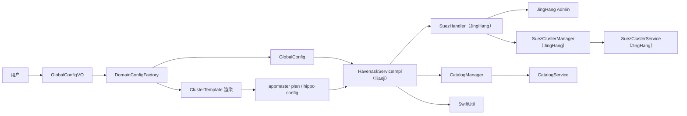
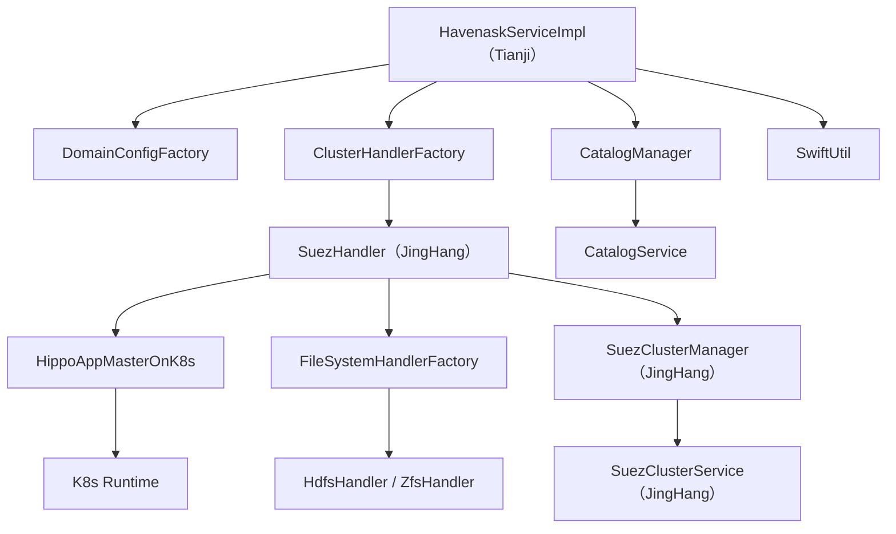
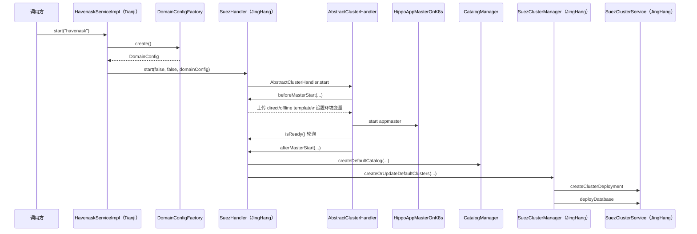
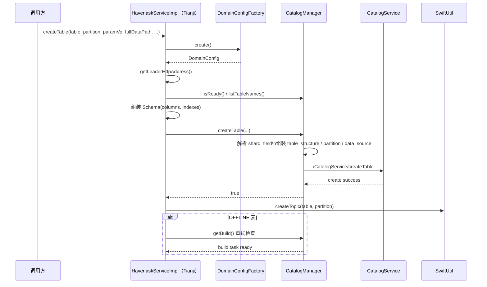

# 天玑ops后端分享

## 部署层级

1. 在线集群分组（在线分组）
   类型：逻辑概念；
   定义：由多个在线集群构成，一个在线分组对应一个业务（Biz），是业务维度的部署单元。
2. 在线集群
   类型：物理概念（按机房划分）；
   定义：由一个 QRS 集群 + 一个 Searcher 集群构成，是机房维度的部署单元。
3. 角色集群
   定义：由完全相同的一组实例构成，按业务角色命名，如 QRS 集群、Searcher 集群、Broker 集群等，是实例角色维度的部署单元。
4. 层级关联规则：一个 JingHang Admin 对应一个在线分组；一个在线分组包含多个在线集群；一个在线集群包含一个或多个角色集群。

## 在线基础组件

核心链路如下：配置与发布由 Admin 负责，在线检索链路通常由 `QRS -> Searcher` 承担，离线与准实时索引构建由 BS 承担，消息、日志与流式数据由 Swift 承担。

**基础组件：**

- kube sharding:
  - 定义：K8s 的二级调度器，由 Ops 通过 YAML 方式部署在 K8s 集群中。
  - 主要功能：承担物理资源管理职责，统一管理各类 Worker（例如 QRS、Searcher、Processor、SwiftBroker），维护既定数量的服务实例，自动执行扩缩容、实例自愈与回收，并通过域名路由实现流量的均衡分发。

- Catalog Service:
  - 主要功能：维护索引数据的元信息，包括索引名称来源、Schema、构建状态等，聚焦**数据层面的管理**；同时维护完整的在线 Target 信息，为 JingHang Admin 提供目标数据。

- Cluster Service:
  - 主要功能：聚焦**在线部署的运行态管理**，维护 K8s 中已拉起的动态集群信息，包括实例的 IP/Port、表布局、流量状态以及已加载索引等。在线服务部署完成后，需要将其运行信息实时写入 Cluster Service，以实现集群状态的持续同步。

**Admin:**

- JingHang admin：
  - 作用：负责在线集群的配置下发、启动与停止、滚动发布、健康检查以及服务发现等管理面能力。一个 JingHang Admin 对应一个在线分组。

- bs admin（Build Service admin）：
  - 作用：索引构建与发布链路的管理面，负责离线与准实时 build 任务的编排及产物管理，并接收索引构建所需的代码包、插件与配置信息。

- swift admin：
  - 作用：Swift 集群的管理面，负责 topic/partition/replica 等资源管理与元信息维护。作为消息队列或日志队列承载增量数据，例如内容更新与行为日志，用于准实时索引或下游消费。其本身并不负责建索，而是承担“实时流数据通道管理”的职责。
  - 常见职责：
    - 上游业务数据首先写入 Swift，再由 `processor` 或 `builder` 持续消费，因此其构成准实时链路的数据入口。
    - topic、partition、副本以及读写状态均由其统一管理，从而为链路运维与故障定位提供支撑。
    - 它将“数据写入”与“索引构建”解耦，上游与下游可以按照各自节奏运行，从而提升链路稳定性。
    - 下游在异常重启或切换时，可以基于消费位点继续处理，从而降低增量数据丢失与重复消费的风险。
  - 概念参见：[数据时效性](#数据时效性)。

**Worker:**

- qrs（Query Rewrite Service / Query Route Service）：
  - 作用：检索链路的入口层，负责接入、协议转换、Query 解析与改写、路由、聚合及结果返回。
  - 常见职责：
    - query 解析（分词、字段解析、过滤条件解析）
    - query 改写（同义词、纠错、拼写归一、分词策略、召回策略选择）
    - 路由与扇出（把请求转发给一个或多个 searcher 分片/集群）
    - 结果聚合（merge 各分片结果，做必要的重排/截断）
  - 输入输出：输入为用户 Query 或检索请求，输出为排序后的文档列表及必要的展示字段。

- searcher：
  - 作用：检索执行层，实际持有索引与正排数据，执行召回、过滤、打分与排序等核心逻辑。
  - 常见职责：
    - 倒排/向量等召回（取候选 docid）
    - 正排取字段（为排序特征与展示取数）
    - 排序（BM25/LTR/多路打分）与过滤（类目/时间/安全策略）

- processor：
  - 作用：数据处理层，负责消费上游增量数据并按配置执行清洗、转换与分发，是在线索引链路中连接 `Swift` 与 `Builder` 的中间 Worker。
  - 常见职责：
    - 消费消息队列中的原始数据（如内容变更、状态变更、行为日志）
    - 按 schema/处理链做字段抽取、格式转换、脏数据过滤、字段补全
    - 将处理后的数据路由到下游 build 链路或其他目标表
    - 保证数据处理链路的连续性，关注消费位点、处理吞吐、失败重试等运行状态

- builder：
  - 作用：索引构建层，负责将 `processor` 输出或离线数据源输入的数据转换为可加载的索引分片，是数据进入 Tianji 检索体系的核心建索 Worker。
  - 常见职责：
    - 接收处理后的增量数据或离线全量数据，并按 schema 执行建索
    - 生成倒排、正排及相关索引文件，形成可发布的分片产物
    - 维护 build task 的执行状态，推进版本生成与构建结果落盘
    - 为后续 `merger` 或在线加载提供可消费的索引产物

- merger：
  - 作用：索引合并层，负责对 `builder` 生成的多个索引分片或多个增量版本进行整理与合并，形成更稳定、更适合在线加载的目标索引版本。
  - 常见职责：
    - 合并多个增量 segment 或分片产物，减少碎片化索引带来的查询与加载开销
    - 整理版本信息，生成新的可发布索引版本
    - 在离线建索或持续增量构建场景中承担版本收敛与产物整合职责
    - 为在线集群提供更完整、可加载的一致性索引结果

## 数据时效性

| 类型       | 定义                                                                                 | 典型特点                                                    |
| ---------- | ------------------------------------------------------------------------------------ | ----------------------------------------------------------- |
| 实时流数据 | 业务侧持续不断产生的事件流，例如内容新增、内容更新、上下架、审核状态变化与行为日志等 | 强调持续产生、低时延处理，通常经由 `Swift` 进入后续建索链路 |
| 离线数据   | 按批次准备和处理的数据，通常来自 Hive、HDFS、DB 导出等离线存储                       | 强调批量处理与全量构建，通常用于全量建索、重建、补数与校正  |

## 索引时效性

- 准实时索引：
  - 指业务数据发生变更后，并非以毫秒级时延立即进入可检索状态，而是经过 `Swift -> processor -> builder -> index` 链路，在较短延迟内完成索引更新。
  - “准实时”通常强调在秒级至分钟级时延内生效，而非严格意义上的“写入后立即可检索”。
  - 该模式依赖实时流数据持续进入系统，并由下游持续消费与建索，因此本质上属于“流式增量索引更新”。
  - 相较于离线全量建索，准实时索引的数据生效速度更快；相较于强实时系统，其允许链路中存在消费、处理、构建与发布所带来的自然延迟。

| 维度         | 离线索引                 | 准实时索引                     | 实时索引❌             |
| ------------ | ------------------------ | ------------------------------ | ---------------------- |
| 数据进入方式 | 按批次导入               | 持续接收增量数据               | 写入后立即进入检索链路 |
| 时效性       | 较低                     | 秒级至分钟级                   | 毫秒级至近实时         |
| 主要目标     | 全量构建、稳定性、可回溯 | 低时延生效与链路平衡           | 极致时效性             |
| 典型场景     | 全量建索、重建、补数     | 内容更新、状态变更、准实时检索 | 强一致性检索、写后即查 |

## 流程讲解

可从 `用户 -> tianji-ops-service -> tianji/swift/bs` 这一主链路理解整体流程。

- 配置加载：
  - 前端参数首先进入 `GlobalConfigVO`，随后由 `DomainConfigFactory` 组装为 `DomainConfig`。

- 配置模板注入：
  - `DomainConfigFactory` 会用 `GlobalConfig` 作为上下文，渲染 `conf/cluster_templates/**` 下的模板文件。
  - 该步骤会产出 appmaster plan、Hippo 配置以及建表模板等后续流程所需的配置内容。

- 集群启动与初始化：
  - `HavenaskServiceImpl.start("havenask")` 会进入 `SuezHandler`，先拉起 JingHang Admin，再初始化默认 catalog、database 与 cluster deployment。

- 建表与增量通道准备：
  - `HavenaskServiceImpl.createTable(...)` 会先在 Catalog 中注册表，再创建对应的 Swift topic，以供准实时链路持续消费。

## 代码讲解

### 模块介绍

- `HavenaskServiceImpl`：
  - Tianji 相关能力的服务入口，`start`、`createTable` 与 `deleteTable` 等能力均从此处进入。
  - 该层负责串联配置、集群、Catalog 与 Swift 等多个子模块。

- `DomainConfigFactory`：
  - 负责构造 `DomainConfig`，里面包含 `GlobalConfig` 和 `ClusterTemplate`。
  - `GlobalConfigVO` 的覆盖项会先落到 `GlobalConfig`，然后再通过 Handlebars 渲染 `conf/cluster_templates/**` 下的模板文件。
  - 该层的职责是将前端配置或默认配置转换为后端可直接使用的上下文。

- `ClusterHandlerFactory` + `SuezHandler`：
  - `ClusterHandlerFactory` 负责按集群类型拿到对应的 Handler。
  - Tianji 对应的实现为 `SuezHandler`，其负责集群启动前准备、Admin 就绪检查以及启动后的默认 catalog 与默认 cluster 初始化。

- `FileSystemHandlerFactory` + 各类 FileSystemHandler：
  - 负责统一屏蔽底层存储访问细节，根据路径协议选择不同实现，例如 HDFS、ZFS 等。
  - 在 Tianji 启动流程中，`SuezHandler.beforeMasterStart` 会通过该层创建存储目录，并上传 `direct_table` 与 `offline_table` 模板。
  - 该层解决的是配置与模板最终存储位置及其读写方式的问题。

- `HippoAppMasterOnK8s` + K8s 相关模块：
  - 负责把 appmaster 以及对应角色实例真正拉起到 K8s 中。
  - `AbstractClusterHandler.start` 在完成配置准备后，会调用 `HippoAppMasterOnK8s.start(...)` 启动集群。
  - 该层更偏向资源编排与运行时落地，解决的是“配置完成后，服务实例如何真正启动并运行”的问题。

- `SuezClusterManager` + `SuezClusterService`：
  - `SuezClusterManager` 负责组装 Searcher 与 QRS 的 cluster deployment 结构。
  - `SuezClusterService` 负责实际调用 JingHang 的 HTTP 接口，例如 `/ClusterService/createClusterDeployment` 与 `/ClusterService/deployDatabase`。

- `CatalogManager` + `CatalogService`：
  - `CatalogManager` 负责组装 Tianji 建表所需的 table JSON、partition、data source 与 custom metas 等结构。
  - `CatalogService` 负责真正调用 `/CatalogService/createCatalog`、`/CatalogService/createDatabase`、`/CatalogService/createTable` 等接口。

- `SwiftUtil`：
  - 建表成功后，会继续创建同名 swift topic，供准实时增量链路消费。
  - 因此，从代码实现看，建表不仅是 Catalog 建模过程，同时也会完成增量通道的准备。

### 创建集群

- 代码入口：
  - `HavenaskServiceImpl.start(key)`
  - 当 `key = havenask` 时，会通过 `ClusterHandlerFactory` 获取 `SuezHandler`

- 典型流程：
  - `HavenaskServiceImpl.start` 首先通过 `DomainConfigFactory.create()` 构造当前域的配置上下文。
  - `AbstractClusterHandler.start` 负责通用启动骨架，包括检查是否已启动、读取 appmaster plan、执行 `beforeMasterStart`、拉起 appmaster、轮询 Admin Ready 状态以及执行 `afterMasterStart`。
  - `SuezHandler.beforeMasterStart` 会准备底层存储目录，并将 `direct_table` 与 `offline_table` 模板上传至 HDFS，同时将模板地址写入环境变量。
  - 在 appmaster 拉起并 Ready 之后，`SuezHandler.afterMasterStart` 会调用 `CatalogManager.createDefaultCatalog` 创建默认 catalog、database 与 tableGroup。
  - 随后调用 `SuezClusterManager.createOrUpdateDefaultClusters` 创建默认 deployment，其中包含一个 `searcher` cluster 与一个 `qrs` cluster。
  - 最后通过 `SuezClusterService.deployDatabase` 将默认 database 绑定至 searcher cluster，从而完成表与在线集群部署关系的建立。

- 关键点：
  - 从代码实现看，“创建集群”并不止于拉起 Tianji Admin，还包括默认 catalog、database、tableGroup、cluster deployment 与 database deployment 的初始化。
  - `cluster_template` 在该流程中至关重要，尤其是 `hippo/searcher_hippo.json` 与 `hippo/qrs_hippo.json`，其内容直接决定 Searcher 与 QRS 的部署配置。

### 创建表

- 代码入口：
  - `HavenaskServiceImpl.createTable(...)`

- 典型流程：
  - 首先通过 `DomainConfigFactory.create()` 获取当前域配置，再通过 `getLeaderHttpAddress` 获取 JingHang Leader 的 HTTP 地址。
  - 根据 `fullDataPath` 是否为空判断是 `DIRECT` 表还是 `OFFLINE` 表。
  - 通过 `catalogManager.isReady` 和 `catalogManager.listTableNames` 做基础校验，避免 admin 未就绪或重复建表。
  - 用 `CreateTableParamVo` 里的 `columns` 和 `indexes` 组装出 `Schema` 对象。
  - `CatalogManager.createTable` 负责将 Schema 转换为 Tianji 所需的 table JSON：
    - 解析 `shard_field`
    - 生成 `table_structure_config`
    - 生成 partition 信息
    - 生成 data source
    - direct 表只挂 `swift` 数据源
    - offline 表同时挂 `file + swift` 两类数据源
    - `custom_metas` 中会写入 `swift_root`、`template_md5`，offline 模式下还会写入 `zookeeper_root`
  - `CatalogService.createTable` 最终调用 `/CatalogService/createTable` 将该表注册到 Tianji Catalog 中。
  - Catalog 建表成功后，`HavenaskServiceImpl` 会继续调用 `SwiftUtil.createTopic(table, partition)` 创建同名 topic。
  - 若为 `OFFLINE` 表，还会通过 `catalogManager.getBuild` 轮询 build task 是否已生成，以确认离线建表任务已经建立。

- 关键点：
  - 从代码实现看，“创建表”可分为两个阶段：首先在 Catalog 中定义表，其次创建对应的 Swift topic。
  - `DIRECT` 表更偏向在线增量写入；`OFFLINE` 表除增量通道外，还会额外挂接全量文件数据源，以支持离线建索。

### 总结

- 创建集群：通过 `SuezHandler` 拉起 Tianji Admin，并初始化默认 catalog、database 以及 qrs/searcher deployment。
- 创建表：通过 `HavenaskServiceImpl + CatalogManager` 将 Schema、partition 与 data source 注册到 Catalog 中，并创建对应的 Swift topic。
- 二者结合后，集群侧解决“服务如何运行”的问题，表侧解决“数据如何定义、如何进入系统以及如何被加载”的问题。
